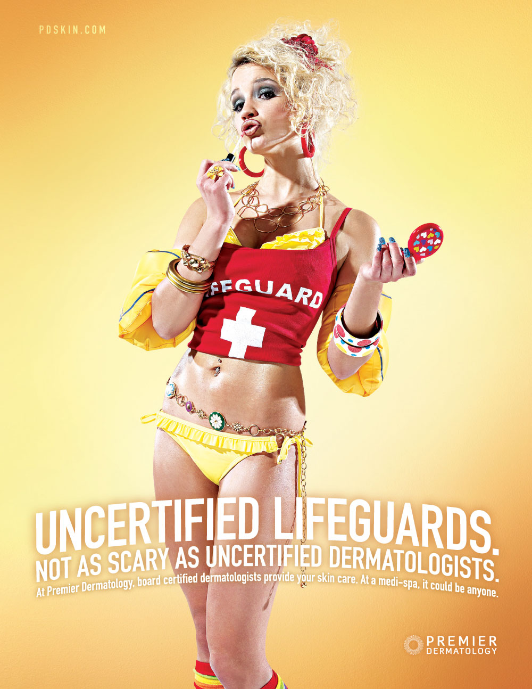
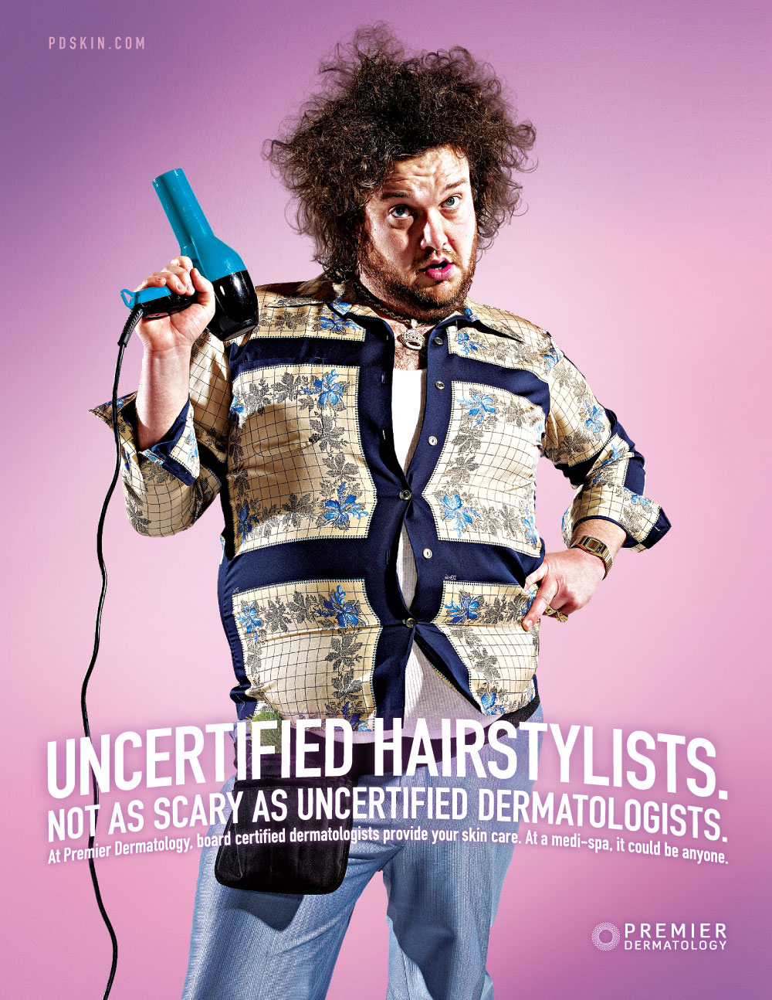
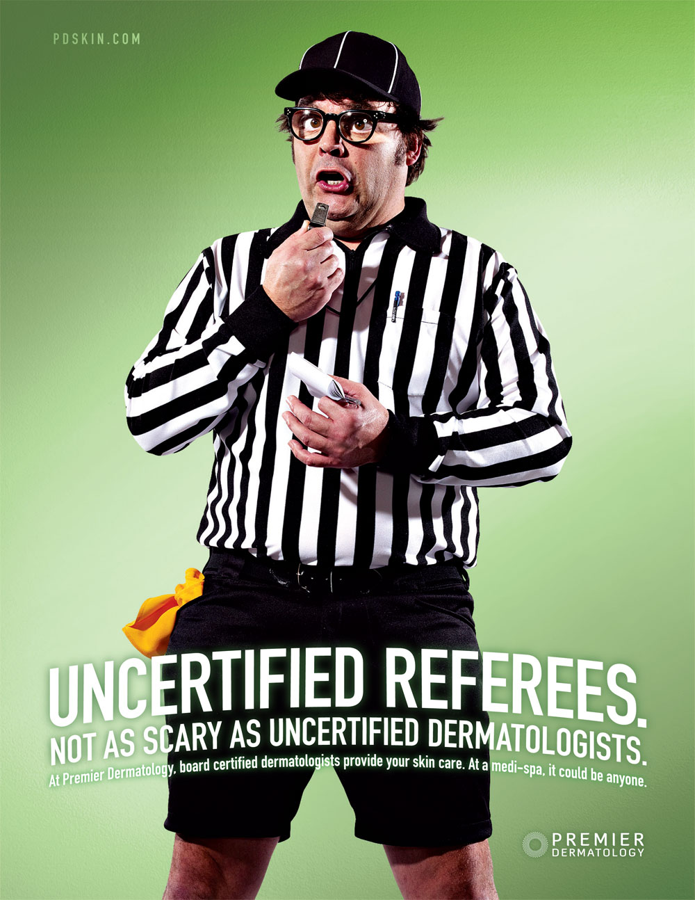
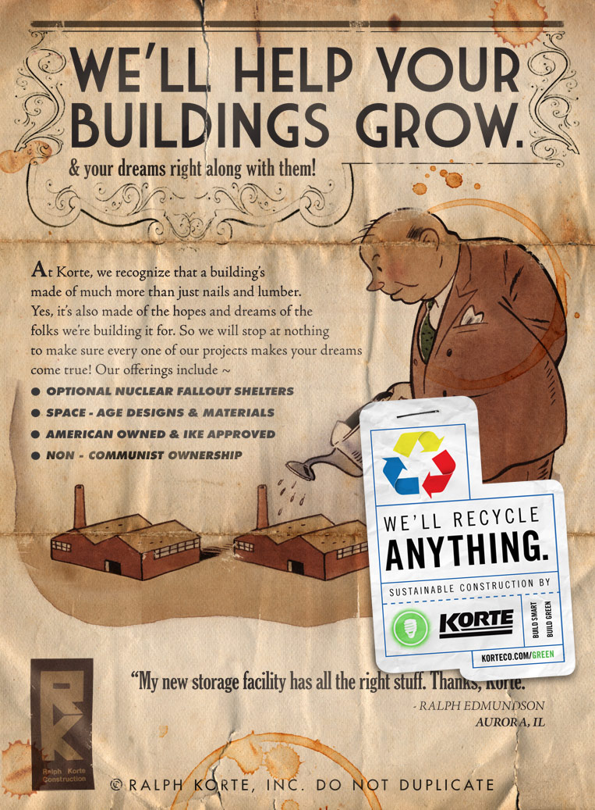
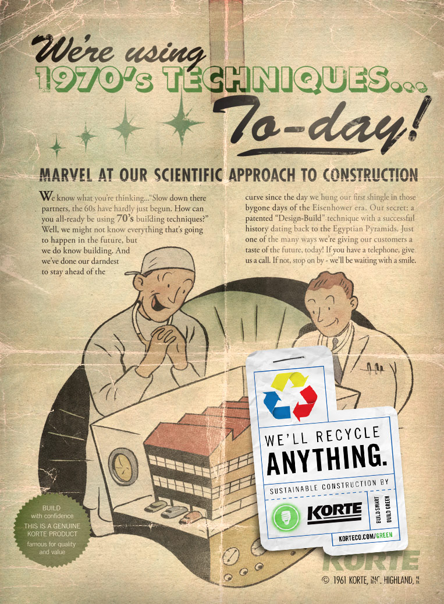
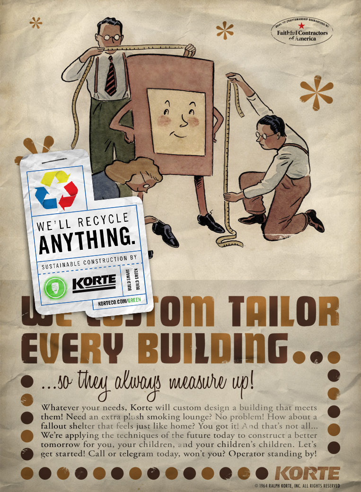

  

    

    <h1 class="word">Advertising</h1>
  

  <h6 class="page-subhead-timespan">
    2005-2011
  </h6>
  <h6 class="page-subhead-responsibilities">
    Art Director
  </h6>

  <h3 class="page-body-subhead">
    In the beginning
  </h3>
  

    ...there was art direction. It was 2005 and fresh out of school I got a job in Chicago creating TV commercials at a big ad agency called DDB. It was a dream job for me at that time, but intimidating – I was 25 and surrounded by some of the best comedy writers outside of Hollywood. All my partner and I had to do was write funnier scripts than them, and they'd fly us out to LA to cast, shoot and edit them. And we somehow managed to do that a time or two.
  

  <h4 class="page-body-interior-subhead">
    Bud Light
  </h4>

  

    Ted Ferguson, Bud Light Daredevil was an up and coming YouTube star who would film himself doing stunts like resisting the last slice of pizza and talking to his parents about his future, all for the promise of a cold one if he could make it. We made a bunch of these but something about this one is my favorite.
  

  

    <iframe width="540" height="315" src="https://www.youtube.com/embed/Xw5sJ04HkbM" frameborder="0" allow="accelerometer; autoplay; encrypted-media; gyroscope; picture-in-picture" allowfullscreen></iframe>
  

  

    The writer at my agency who originally pitched the chatacter did such a good job the folks at Anheuser-Busch casted him as Ted Ferguson. Shout out to Jeb Quaid.
  

  

    If you're a person of a certain age, you likely remember the "Real Men of Genius" radio campaign for Bud Light. It celebrated the often overlooked heroes of everyday of life in the good ol' US of A, and I had a chance to work on this one.
  

  

    <iframe width="540" height="166" scrolling="no" frameborder="no" allow="autoplay" src="https://w.soundcloud.com/player/?url=https%3A//api.soundcloud.com/tracks/48091067&color=%23ff5500&auto_play=false&hide_related=false&show_comments=true&show_user=true&show_reposts=false&show_teaser=true"></iframe>
  

  <h4 class="page-body-interior-subhead">
    Big Ten Network
  </h4>

  

    Basketball dimples as goosebumps. It was a lot of fun seeing this one through the special effects process.
  

  

    <iframe src="https://player.vimeo.com/video/19639144" width="640" height="360" frameborder="0" webkitallowfullscreen mozallowfullscreen allowfullscreen></iframe>
  

  <h4 class="page-body-interior-subhead">
    Premier Dermatology
  </h4>

  

    I also got to work on some smaller local clients. This campaign stood out as a time when one of them was willing to take a fun risk. The idea was that all these MediSpa's were popping up and doing dermatology work without being certified, which was as bad as trusting uncertified people in any other profession.
  

  <figure class="figure-inline">
    
    <figcaption class="case-study-caption"></figcaption>
  </figure>

  <figure class="figure-inline">
    
    <figcaption class="case-study-caption"></figcaption>
  </figure>

  <figure class="figure-inline">
    
    <figcaption class="case-study-caption"></figcaption>
  </figure>

  <h4 class="page-body-interior-subhead">
    Korte Construction
  </h4>

  <figure class="figure-inline">
    
    <figcaption class="case-study-caption"></figcaption>
  </figure>

  <figure class="figure-inline">
    
    <figcaption class="case-study-caption"></figcaption>
  </figure>

  <figure class="figure-inline">
    
    <figcaption class="case-study-caption">A campaign for Korte Construction. They were getting into green building methods and wanted a cheeky campaign to show they they would even recycle their "old ads".</figcaption>
  </figure>

  <nav class="case-study-end-nav">
    <a href="/ofa" class="case-study-previous-link">
      

        2011-2012
      

      Obama 2012
    </a>
    <a href="/" class="case-study-next-link home-next-link">
      Home
    </a>
  </nav>

