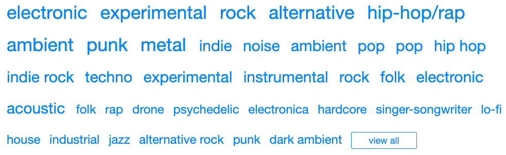
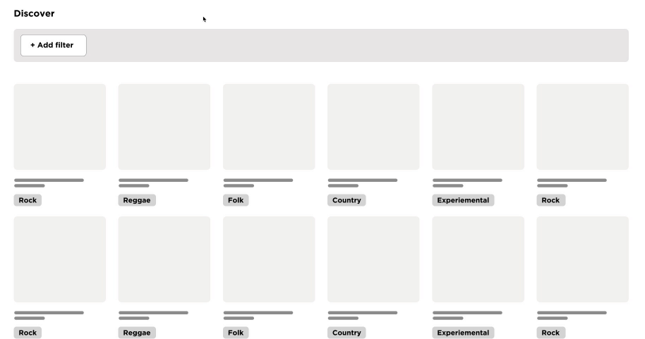
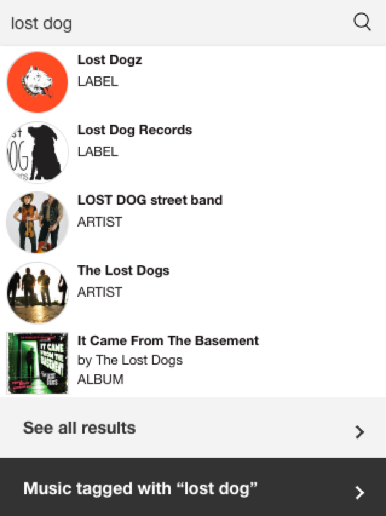
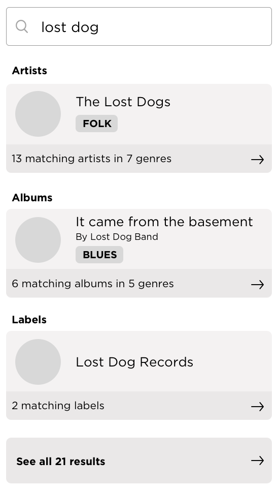
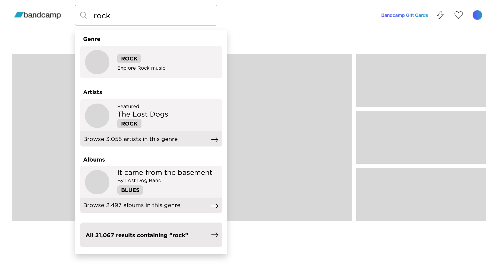
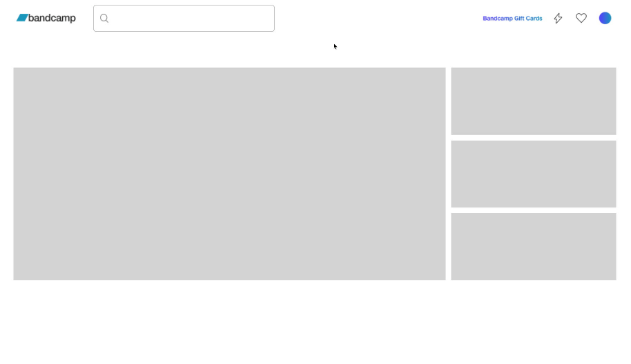

  

    

    <h1 class="word">Bandcamp</h1>
  

  <h6 class="page-subhead-timespan">
    December 2019
  </h6>
  <h6 class="page-subhead-responsibilities">
    Design Exercise
  </h6>

  <h3 class="page-body-subhead">
    Unifying Discovery
  </h3>
  

    Over the years, Bandcamp had developed two distinct patterns for discovering new music. A Discover feature allows visitors to filter for the type of music they're looking for along five dimensions: genre, location, format, release date (time), and best-selling/new arrivals/artist-recommended.
  

  

    Additionally, visitors are able to select music tagged with a particular location or genre using a Browse By Tags feature.
  

  

    To simplify discovery on the platform, let's look at how we might bring the Search and Discovery experiences closer together to provide a cohesive, powerful, yet simple way to find new music and emerging artists.
  

  <h4 class="page-body-interior-subhead">
    Process
  </h4>
  

    Absent any users to speak with or analytics to consult, I began by experimenting with the possibilities allowed by the current discovery solutions. An early conclusion from this was that the functionality provided by "browse by tags" is duplicated in the Discover filters. By adding the Location option, I was now able to filter on both Genre and Location within the Discovery interface, which effectively replaced Browse by Tags. While it may serve legacy functions I'm not aware of, I'm going to assume we're safe to deprecate this and focus my attention on Discover and Search.
  

  <figure class="figure-inline">
    
    <figcaption class="case-study-caption">Goodnight, sweet prince. 🎻 </figcaption>
  </figure>
  

    Next, I wanted to see what was possible using the horizontal Discover filtering menus. After spending some time selecting different filter combinations and looking at the output, I found myself wishing certain things were possible. First, a way to select multiple genres, locations or formats rather than just one of each. Second, a more semantic, straightforward way to see and read what I had filtered for. Lastly,
    the filters take up a lot of space in the view, which is particularly problematic in the native app where viewport width is constrained. How might we condense them?
  

  

    One potential solution to satisfy these requirements is to organize Discovery filtering into a single row, and allow users to build their filters in a logical progression that reads as a plain english sentence. I put together a <a href="https://www.figma.com/proto/0OFEsclIerWtWRMgVdpwZr/bandcamp?node-id=0%3A44&viewport=-136%2C-8524%2C0.5&scaling=min-zoom" target="_blank">prototype</a> in Figma to show an example flow:
  

  <figure class="figure-inline">
    
    <figcaption class="case-study-caption">Here's where I point out there are absolutely no visual design suggestions here 😅</figcaption>
  </figure>
  

    I chose not to include best selling vs. new releases vs. artist-recommended in the filtering. My inclination would be to scrap New Releases as a standalone option since Release Date (Time) as a filtering option can satisfy that need with even better flexibility. Best-selling / Artist-recommended could be a toggleable option beneath the filtering, separated out under subheadings, or we could make a call based on research and simply show one or the other.
  

  

    To answer the brief, I needed to make sure the Search and Discover experiences felt cohesive, so now that I had some familiarity around the Discover tools under my belt, I began looking for ways to make Search feel like part of the same app and experience.
  

  <figure class="figure-pullout">
    
    <figcaption class="case-study-caption">It's tough to discern between entries and categories in the current search dropdown.</figcaption>
  </figure>
  

    I tried typing various strings into the Search field to observe how the system responded, noting that simply putting it into focus displayed a menu of popular genres.
  

  

    When I enered text, my first observation was that the visual affordances were quite disparate from what I was used to in Discover. Gone were the punchy colors and plump pill buttons, giving way to a more stripped down, system look and feel.
  

  

    When I clicked through to the results page, I saw three different categories represented: Artists, Albums and Labels; however there was no way to indicate which category I was interested in and ignore the rest. I came away with the impression that Search as currently designed is better suited to finding something or someone very specific, rather than discovering new stuff I might be into.
  

  

    As a new user, I found myself wishing for better category differentiation, and a look and feel that afforded better cohesion with the pill-button styling of the discovery interface. I put together a quick wireframe:
  

  <figure class="figure-inline">
    
    <figcaption class="case-study-caption">Bringing genre into the search results in the same pill-button style could be one way to tie Search to Discovery visually.</figcaption>
  </figure>
  

    By grouping the instant results in the dropdown together by type (artists, albums, labels), with the top result shown by default, we allow users to quickly access the type of content they're looking for, rather than sifting through all categories and results mashed together.
  

  

    If a genre is searched for, say "Rock", we can use a similar pattern to lead to the genre exploration (Discover filtered by Rock), as well as results grouped by artist, album or label; perhaps even including a 'featured' item in the instant results (new revenue stream?). Showing results that contain the string "rock" is less helpful in the search dropdown but could be accessed and browsed as a separate category:
  

  <figure class="figure-inline">
    
    <figcaption class="case-study-caption"></figcaption>
  </figure>
  

    The results view could then be separated by type, perhaps using tabs, and the results below treated in the same grid style as the discover results, marrying the two conceptually. The flow might look something like this:
  

  <figure class="figure-inline">
    
    <figcaption class="case-study-caption"></figcaption>
  </figure>
  

    And that's that! I'm sure some of this thinkng is naive to business and/or technical constraints, but knowing only what I know, I think it's a step in the right direction. I really enjoyed thinking through this! Cheers.
  

  <nav class="case-study-end-nav">
    <a href="/" class="case-study-previous-link">
      Home
    </a>
    <a href="/freelance" class="case-study-next-link freelance-next-link">
      

        2013-2014
      

      Freelance
    </a>
  </nav>

