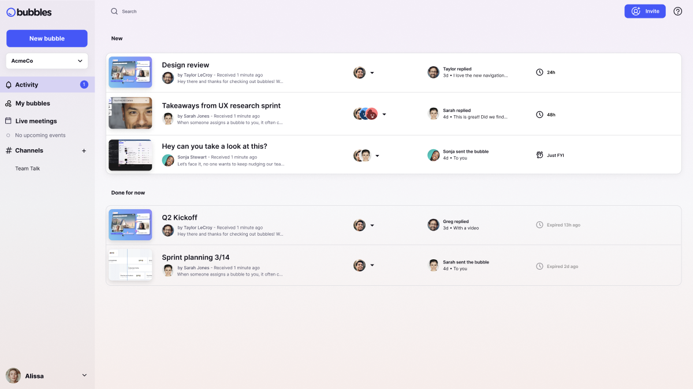
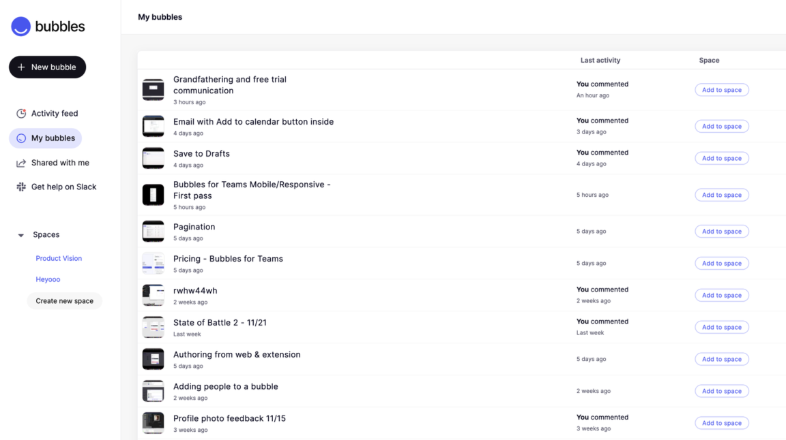
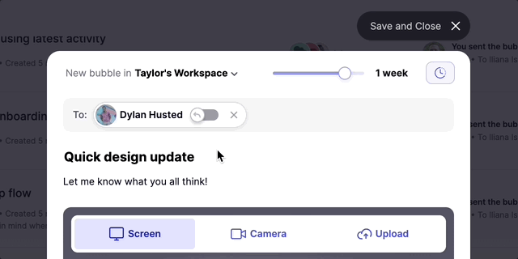

  

    

    <h1 class="word">Bubbles</h1>
  

  <h6 class="page-subhead-timespan">
    2022-2024
  </h6>
  <h6 class="page-subhead-responsibilities">
    Principal Product Designer
  </h6>

  <h3 class="page-body-subhead">
    Reimagining Remote Collaboration
  </h3>
  <figure class="figure-inline">
    
    <figcaption class="case-study-caption">The Bubbles inbox. Wake up to a feed of screen recordings from your remote teammates, with response expectations attached.</figcaption>
  </figure>
  <figure class="figure-pullout">
    
    <figcaption class="case-study-caption">This was Bubbles when I started: a free-to-use, single-player screen recorder.
    </figcaption>
  </figure>
  

    In Summer 2022 I joined a seed-stage startup called Bubbles as Principal Product Designer. At the time, Bubbles was a single-player, free-to-use screen recorder - think Loom, but with a vision to become more of a back-and-forth conversational platform for remote team collaboration, rather than a presentational tool.

    The journey that followed would teach me valuable lessons about 0-to-1 product design, user psychology, and the delicate balance between innovation and user needs.
  

  <h3 class="page-body-subhead">
    The challenge
  </h3>
  

    Bubbles had a core group of about 20,000 monthly active users who were big fans. They loved the app for it's lightweight onboarding, ease-of-use, and of course the fact that it was  free.

    Bubbles was well-liked and useful, but not yet transformative. Users could record their screen, add their camera feed, and share links. While functional, it wasn't addressing the deeper challenges related to working with people who may be going to sleep when you were waking up, and vice-versa.
  

  

    Having a supportive user community was great, but the writing was on the wall: Bubbles could not remain viable as a free tool and needed to find a path to monetization. Quickly.
  

  <h4 class="page-body-interior-subhead">
    Uncovering the Real Problem
  </h4>
  

    I began working with PMs to interview remote workers in our target audience, revelaing a critical insight: the true pain point for remote teams wasn't about recording quality or features – it was about <strong>uncertainty</strong>. 
  

  

    Teams working across time zones were stuck in a perpetual state of limbo, never knowing when (or if) they'd receive the input or feedback needed to keep their projects moving on schedule. Projects would stall, momentum would fade, and frustration would mount. This revelation led to our first major innovation: time-bounded collaboration.
  

  <h4 class="page-body-interior-subhead">
    The Power of Deadlines
  </h4>
  

    We introduced expiration dates for video messages – a seemingly simple feature that profoundly impacted user behavior. Authors could now set clear expectations for response times, and recipients understood their role in the communication flow through our "response required" vs. "response optional" system.
  

  <figure class="figure-inline">
    
    <figcaption class="case-study-caption">The bubble author can adjust the respose expectations per recipient, and select the time frame for all desired responses.</figcaption>
  </figure>
  <h4 class="page-body-interior-subhead">
    Building for Scale and Security
  </h4>
  

    As we gained traction with larger teams, we recognized the need for more structured collaboration. We implemented:
    <ul>
      <li>Role-based access control for enterprise security</li>
      <li>Project-based channels for organized communication</li>
      <li>Flexible timer extensions for Pro users</li>
    </ul>
  

   
  <h4 class="page-body-interior-subhead">
    The AI Evolution
  </h4>
  

    Our biggest bet came with the integration of AI technology. We developed an intelligent meeting recorder that could:
    <ul>
      <li>Connect with existing calendar systems like Google and Outlook</li>
      <li>Automatically transcribe meetings, delivering summaries and next steps</li>
      <li>Create smart sharing rules</li>
      <li>Generate follow-up spaces for asynchronous discussion</li>
    </ul>
  

   
  <h4 class="page-body-interior-subhead">
    The Final Vision: Your Video Inbox
  </h4>
  

    The culmination of our work was a beautifully designed video inbox – a morning destination for catching up with your team's updates. It represented a fundamental shift from reactive to proactive collaboration.
  

  <h3 class="page-body-subhead">
    Impact & Learnings
  </h3>
  

    While Bubbles ultimately didn't secure Series A funding, we achieved significant milestones. The company grew from $0 to $200K ARR through word-of-mouth, transformed free users into paying customers, and built a product that users genuinely loved using.
  

  <h4 class="page-body-interior-subhead">
    Key Design Principles I Learned
  </h4>
  

  • Start with user psychology, not features 
  • Make complexity feel effortless 
  • Design for habits, not just actions 
  • Balance innovation with familiarity 
  

   
  <h4 class="page-body-interior-subhead">
    Reflection
  </h4>
  

    Looking back, Bubbles was more than a product – it was an experiment in changing how teams communicate. While we may not have reached our ultimate goal, we proved that with thoughtful design and clear focus on user needs, you can create meaningful change in how people work together.

    The journey from simple screen recorder to sophisticated collaboration platform taught me that great product design isn't just about solving problems – it's about understanding human behavior and creating experiences that feel natural, intuitive, and empowering.
  

  
  <nav class="case-study-end-nav">
    <a href="/" class="case-study-previous-link">
      Home
    </a>
    <a href="/olark" class="case-study-next-link freelance-next-link">
      
        2014-2019
      
      Olark
    </a>
  </nav>

