

  

    

    <h1 class="word">Bubbles</h1>
  

  <h6 class="page-subhead-timespan">
    2022-2024
  </h6>
  <h6 class="page-subhead-responsibilities">
    Principal Product Designer
  </h6>

  <h3 class="page-body-subhead">
    Redesigning Remote Collaboration
  </h3>
  

    In 2022 I joined a seed-stage startup called Bubbles as Principal Designer. At the time, Bubbles was a single-player, free-to-use screen recorder - think Loom, but with a vision to become a video-first, back-and-forth conversational platform for remote team collaboration, rather than one-way presentations.
  

  

    What followed was two years of learning how hard it is to get people to actually change how they work, and occasionally succeeding anyway.
  

  <h4 class="page-body-interior-subhead">
    The baseline and the vision
  </h4>
  

    Bubbles had a core group of about 20,000 monthly active users. They were outspoken supporters who loved the app for its lightweight onboarding, ease-of-use, and most of all the fact that it was entirely free.
  

  

    While a no-cost, single-player screen recorder was well-liked and useful, it wasn't yet transformative. Our team shared a distaste for hastily typed, low-signal feedback, and a long-term vision of a video-first, async communication platform for remote teams. As Principal Designer, I was tasked with transforming Bubbles into a product that supported that vision. It would mean addressing not just technical challenges but psychological ones. How might we convince teams - not just individual users - to rethink and change the ways they'd been communicating for decades?
  

  

    And then there was the existential crisis all venture-backed startups eventually face: become profitable, or die trying.
  

  <h4 class="page-body-interior-subhead">
    Uncovering the real problem
  </h4>
  

    We spent a month interviewing remote workers and realized we'd been solving the wrong problem. Nobody actually cared about recording quality or features. What was killing them was uncertainty. The awful limbo of not knowing if your stakeholder in Berlin would get back to you before your deadline in San Francisco. 

    Remote teams relying on traditional channels like Slack and email had a common pain point. Work would stall, momentum would fade, frustration would mount. This revelation led to our first major bet: time-bounded collaboration.
  

  <h4 class="page-body-interior-subhead">
    The power of the deadline
  </h4>
  

    We introduced a timer that creators could set when recording their video messages – a simple feature that profoundly impacted users' behavior. Authors could set clear expectations for response times and tag people as either 'Response required' or 'Just FYI.' We'd send reminders to the first group until the deadline hit.
  

  <figure class="figure-rive">
    

      <canvas id="bubbles-responses-canvas" width="1028" height="578" aria-label="The bubble author adjusting the response expectations and time frame for the desired response"></canvas>
    

    
    <figcaption class="case-study-caption">Remote teams need to be direct about who needs to respond, and by when.</figcaption>
  </figure>
  

    By adding the ability to configure who needed to respond, who was just being kept in the loop, and when you needed to hear back; we now had the ability to sort the inbox by highest priority videos. Remote workers could wake up everyday to video responses or contextual written comments on their videos from colleagues in other time zones who had viewed the recordings during their work hours.
  

  <figure class="figure-inline">
    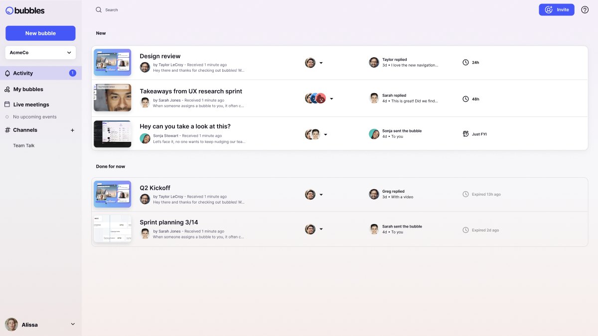
    <figcaption class="case-study-caption">The Bubbles inbox. Wake up to a feed of screen recordings from your remote teammates, with response expectations attached.</figcaption>
  </figure>
  

    Replies to video updates were multi-modal. Video, screen, audio or text could be used not just in the original recording, but in the follow-up conversation and feedback.
  

  <figure class="figure-inline">
    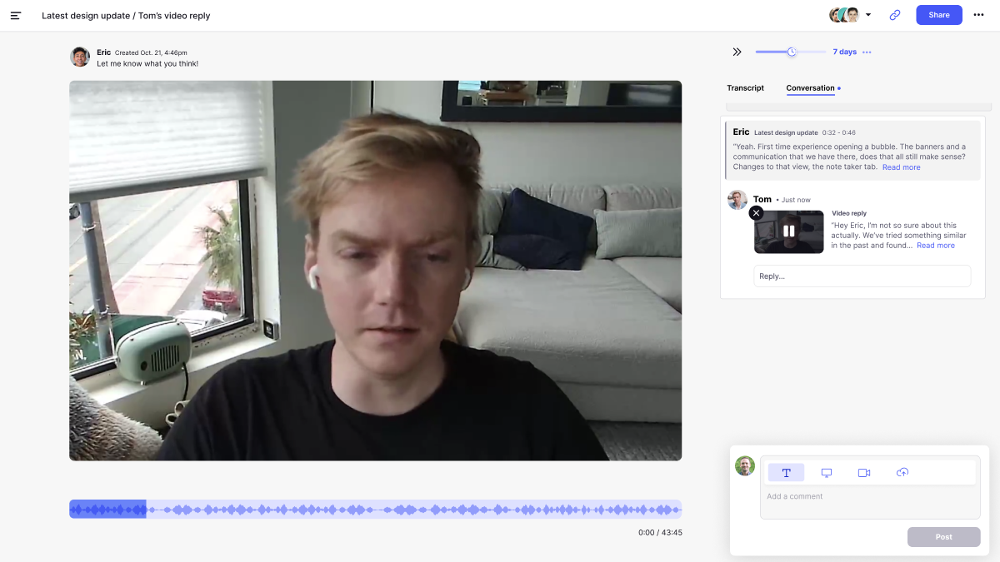
    <figcaption class="case-study-caption">Participants can leave replies in multi-modal format: video, screen share, as well as text.</figcaption>
  </figure>
  <h4 class="page-body-interior-subhead">
    Building for scale and security
  </h4>
  

    After a successful Product Hunt launch, we started getting attention from enterprise customers. As thrilling as that was, we had to address the kind of non-starters you get from customers of that scale:
  

  

      • Role-based access control (because not everyone should see everything) 
      • Project channels to keep topics separated 
      • Flexible timer extensions for Pro users 
      • SOCC 2 + GDPR compliance
  

  <h4 class="page-body-interior-subhead">
    The AI evolution
  </h4>
  

    When AI hit the scene in earnest around 2023, we made our biggest bet yet. If we couldn't convince people to change their habits, we'd meet them where they already were – in endless meetings on Zoom, Microsoft Teams, and Google Meet. We built an intelligent meeting recorder that auto-joined calls, generated AI transcripts, surfaced action items, and fed everything back into Bubbles so teams had a place to follow up async without scheduling <em>yet another</em> meeting.
  

   
  <figure class="figure-inline">
    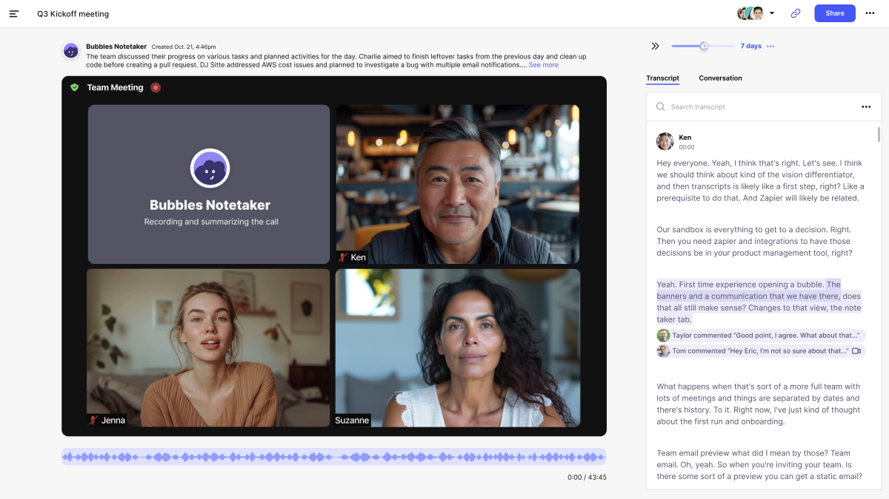
    <figcaption class="case-study-caption">Meetings are perfectly encapsulated with AI transcript and next steps, with space for highlights and discussion. Participants can follow-up without scheduling <em>another</em> synchronous meeting.</figcaption>
  </figure>
  <figure class="figure-inline">
    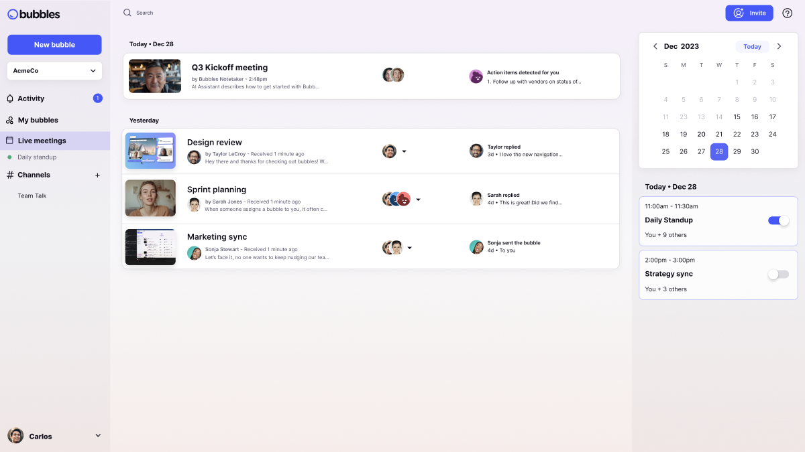
    <figcaption class="case-study-caption">All recordings and transcripts were saved in the app, with granular settings to control which meetings got recorded and who they were shared with.</figcaption>
  </figure>
  <h3 class="page-body-subhead">
    Signup - Balancing UX, Education & Conversion
  </h3>
  

    If I had my way, every product designer would have to spend a couple years at an early stage startup. You've never had to make a truly hard decision until you've been faced with having to increase a certain metric by X%, by Y date, or else the company goes insolvent. How you continue to strategize on behalf of the user and resist the allure of dark patterns and cheap, short-term wins is where real creativity shines through.
  

  <figure class="figure-inline">
    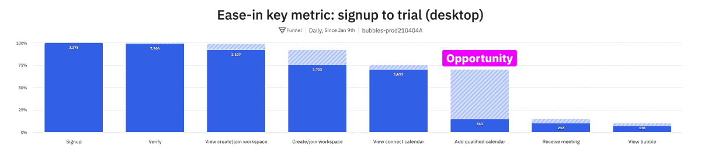
    <figcaption class="case-study-caption"></figcaption>
  </figure>
  

    Looking at our signup funnel, we knew it was critical to raise the percentage of new signups who connected their calendar during signup. This metric correlated so highly with retention and engagement that every percentage point in conversion increase meant a meaningful lift in our chances of survival. Further, the real value of the product couldn't be realized without a connected calendar. We needed a signup flow that made people <em>want</em> to connect their calendar, not feel like they were being pressured into it. Here's what I landed on - a tactful mix of social proof, telling-by-showing, and surfacing the ask in the right moment:
  

  <figure class="figure-inline">
    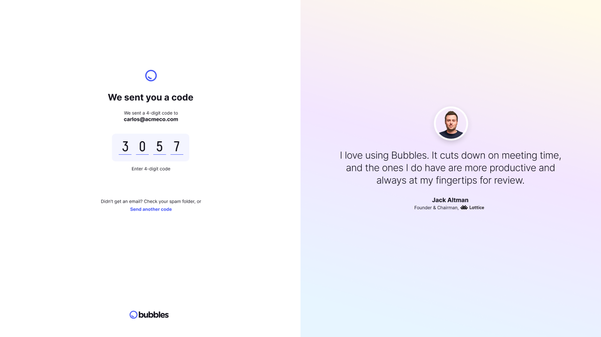
    <figcaption class="case-study-caption">Light social proof without distracting from the task at hand.</figcaption>
  </figure>
  <figure class="figure-inline">
    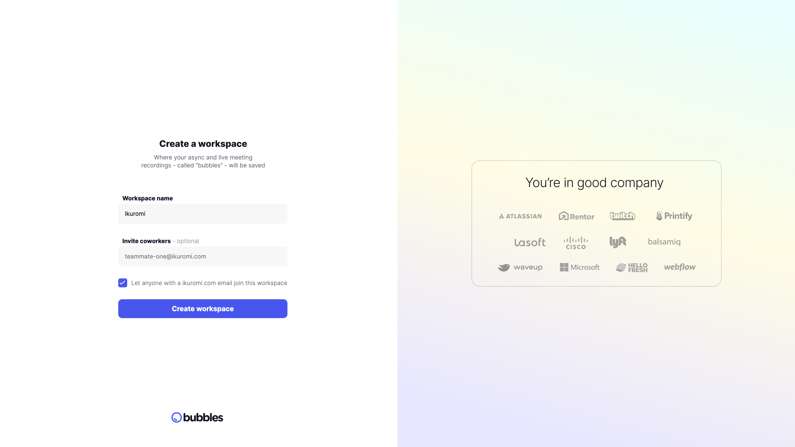
    <figcaption class="case-study-caption">Education. Answering "What is a bubble anyway?" while keeping the social proof coming.</figcaption>
  </figure>
  <figure class="figure-inline">
    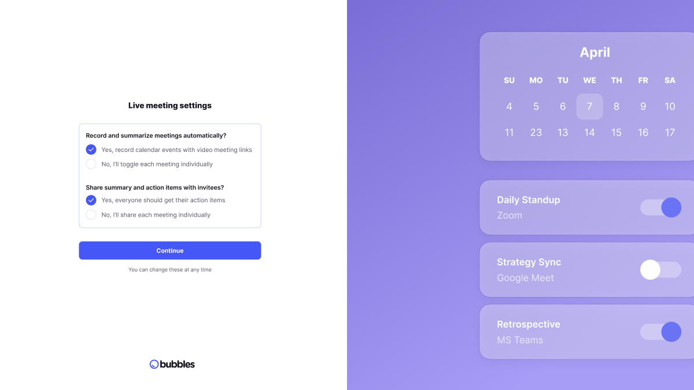
    <figcaption class="case-study-caption">Get out in front of any hesitation around privacy by allowing some security config during the flow.</figcaption>
  </figure>
  <figure class="figure-inline">
    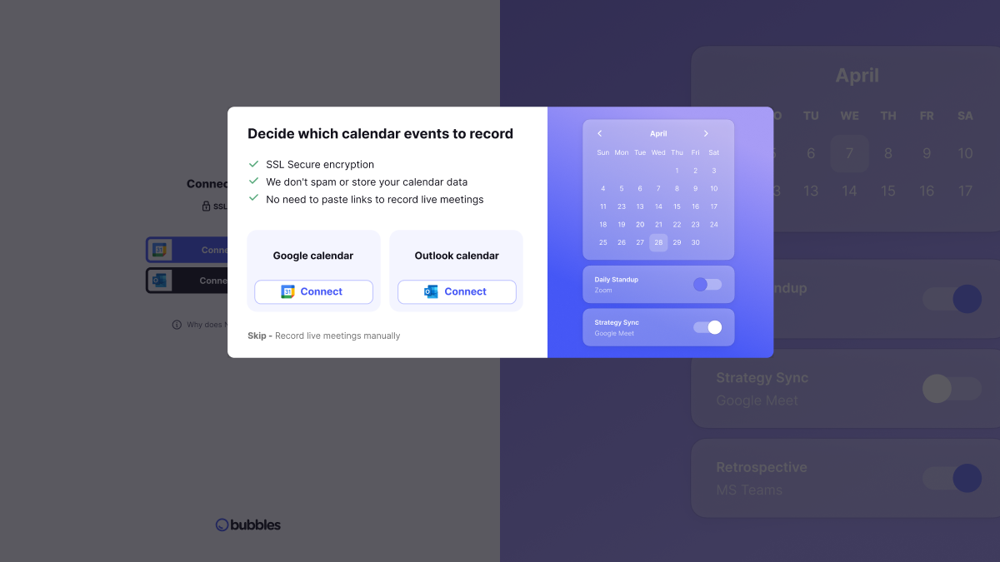
    <figcaption class="case-study-caption">When asking anything of the user, it's key to answer "What's in it for me?"</figcaption>
  </figure>
  

    The result was 19% lift on calendar connection compared to control (where we waited to ask until the user landed in the product). I don't know what that translated to revenue-wise, but Bubbles is still going strong today, when for a minute there it was looking pretty dicey.
  

  <h3 class="page-body-subhead">
    Branding Bubbles
  </h3>
  

    With only two designers working closely together, we didn't have need an extensive system, but being designers we couldn't help but establish a shared design vocabulary to keep things looking fresh and consistent. Here are a few of the artifacts from our minimal style guide - typography, color, spacing, tone and voice, and plenty of collaboration was all we needed to stay in lock step.
  

  <figure class="figure-inline">
    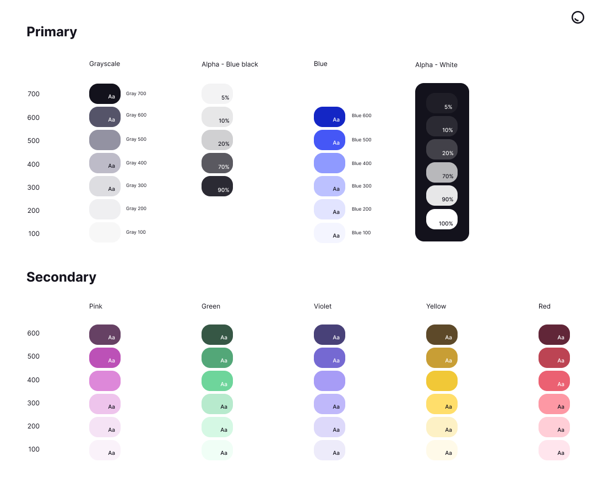
    <figcaption class="case-study-caption"></figcaption>
  </figure>
  <figure class="figure-inline">
    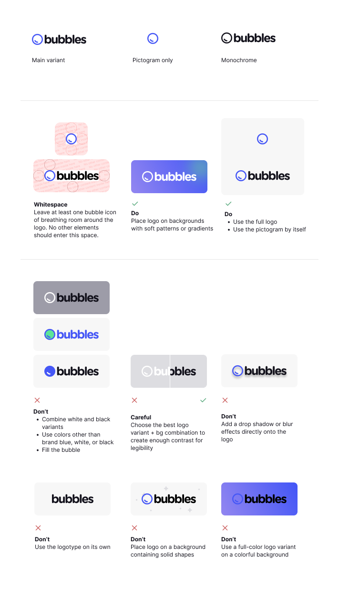
    <figcaption class="case-study-caption"></figcaption>
  </figure>
  <figure class="figure-inline">
    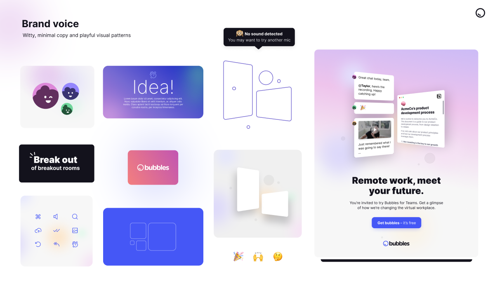
    <figcaption class="case-study-caption"></figcaption>
  </figure>
  <h3 class="page-body-subhead">
    Impact & Learnings
  </h3>
  

    While Bubbles ultimately didn't unlock the explosive growth needed to secure its next round, we we proved our concept with significant milestones. The company grew from $0 to $750K ARR through word-of-mouth, converted thousands of free users into paying customers, and built a product that users raved about using. When we had downtime, folks got LOUD in our public Slack channel. And as stressful as that was, it also felt good to know we'd given them something worth missing, even for a short while.
  

  <h4 class="page-body-interior-subhead">
    What we learned the hard way
  </h4>
  

  • Free users are great for ego, terrible for business. 
  • The best validation isn't what users say, it's whether they actually miss your product when it's gone. 
  • So much more goes into business success than building great product. 
  • People hate changing their communication habits more than they hate bad communication. We had to piggyback on existing workflows instead of replacing them. 
  

  <h4 class="page-body-interior-subhead">
    Design principles I internalized
  </h4>
  

  • Start with user psychology, not features 
  • Make complexity feel effortless 
  • It's nearly impossible to change long-held behavior, no matter how novel the solution, therefore... 
  • Balance innovation with familiarity 
  

  <h4 class="page-body-interior-subhead">
    Reflection
  </h4>
  

    Bottom line: Bubbles didn't become the new Slack. We built something people genuinely loved, grew to half a million in ARR through pure word-of-mouth, and got really good at async collaboration. Then the market decided it wasn't quite ready to break up with Slack and Zoom.
  

  

    Turns out, getting people to change how they communicate is hard. Like, <em>really</em> hard. You can nail the UX, solve real problems, and still lose to the inertia of "this is how we've always done it."
  

  

    I'm proud of what we built. We proved that deadlines make async actually work. We showed that screen sharing beats text walls 10 times out of 10. And we created a product that people actively missed when it was gone, which might be the best measure of good design there is. Sometimes you build the right thing, but the timing or the way you take it to market isn't right. 
  

  
  
    That's startup life. At least we looked good doing it.
  

  
  <nav class="case-study-end-nav">
    <a href="/" class="case-study-previous-link">
      Home
    </a>
    <a href="/mural" class="case-study-next-link freelance-next-link">
      
        2020-2022
      
      Mural
    </a>
  </nav>

