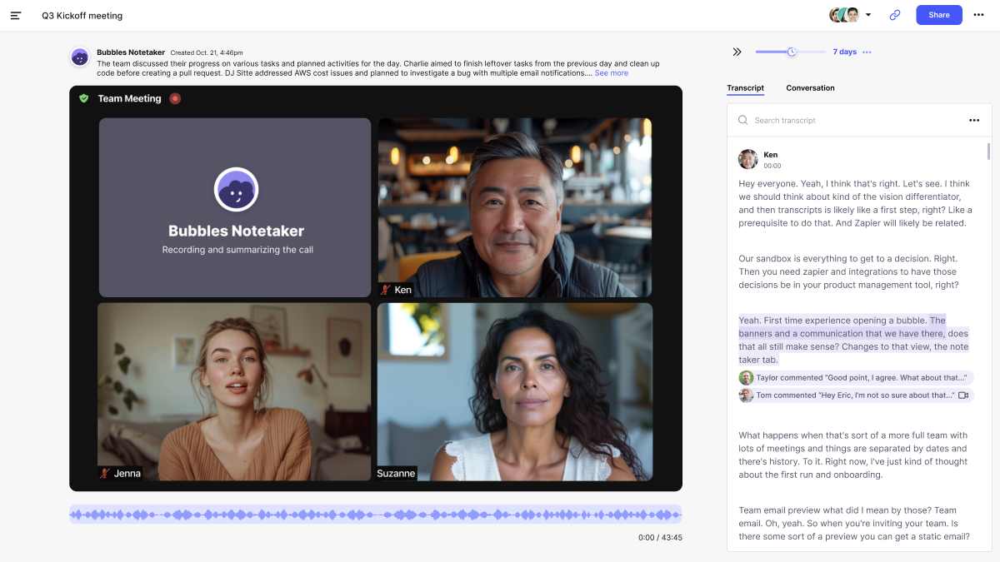

  

    

    <h1 class="word">Bubbles</h1>
  

  <h6 class="page-subhead-timespan">
    2022-2024
  </h6>
  <h6 class="page-subhead-responsibilities">
    Principal Product Designer
  </h6>

  <h3 class="page-body-subhead">
    Reimagining Remote Collaboration
  </h3>
  <figure class="figure-pullout">
    
    <figcaption class="case-study-caption">This was Bubbles when I started: a free-to-use, single-player screen recorder.
    </figcaption>
  </figure>
  

    In 2022 I joined a seed-stage startup called Bubbles as Principal Product Designer. At the time, Bubbles was a single-player, free-to-use screen recorder - think Loom, but with a vision to become a video-first conversational platform for remote team collaboration, rather than one-way presentations.

    What followed was two years of learning how hard it is to get people to actually change how they work – and occasionally succeeding anyway.
  

  <figure class="figure-inline">
    
    <figcaption class="case-study-caption">The Bubbles inbox. Wake up to a feed of screen recordings from your remote teammates, with response expectations attached.</figcaption>
  </figure>
  <h3 class="page-body-subhead">
    The challenge
  </h3>
  

    Bubbles had a core group of about 20,000 monthly active users. They were big fans. They loved the app for its lightweight onboarding, ease-of-use, and most of all the fact that it was entirely free.

    Bubbles was well-liked and useful, but not yet transformative. Users could record their screen, add their camera feed, and share links. While functional, it wasn't living up to our long-term vision of an async communication platform for remote teams. My task was to address the deeper challenges of collaborating across time zones, when your teammates are going to sleep as you're starting your day.
  

  

    We also faced the existential crisis all venture-backed startups eventually hit: figure out how to make money, or die trying.
  

  <h4 class="page-body-interior-subhead">
    Uncovering the real problem
  </h4>
  

    After interviewing a bunch of remote workers, we realized we'd been solving the wrong problem. Nobody actually cared about recording quality or features. What was killing them was uncertainty – the awful limbo of not knowing if your teammate in Berlin would get back to you before your deadline in SF. 
  

  

    People working together across time zones were stuck in a perpetual state of limbo, never knowing when (or if) they'd receive the input or feedback they need to keep their projects moving on schedule. Work would stall, momentum would fade, and frustration would mount. This revelation led to our first major innovation: time-bounded collaboration.
  

  <h4 class="page-body-interior-subhead">
    The power of the deadline
  </h4>
  

    We introduced a timer that creators could set when recording their video messages – a simple feature that profoundly impacted users' behavior. Authors could set clear expectations for response times and tag people as either 'Response required' or 'Just FYI.' We'd send reminders to the first group until the deadline hit.
  

  <figure class="figure-inline">
    
    <figcaption class="case-study-caption">Authors can choose who they need a response from and by when, with smart reminders sent until the deadline.</figcaption>
  </figure>
  

    Having video context for replies was equally important. Our core belief was that screen sharing allowed for visual context that just doesn't come across in an email, bullet points or a wall of text, whether in the original video or in replies and feedback from recipients:
  

  <figure class="figure-inline">
    
    <figcaption class="case-study-caption">Participants can leave replies in multi-modal format: video, screen share, as well as text.</figcaption>
  </figure>
  <h4 class="page-body-interior-subhead">
    Building for scale and security
  </h4>
  

    Once actual enterprises started kicking the tires, we had to grow up fast. That meant:
  

  

      • Role-based access control (because not everyone should see everything) 
      • Project channels (because '#General' is where conversations go to die) 
      • Flexible timer extensions for Pro users 
  

   
  <h4 class="page-body-interior-subhead">
    The AI evolution
  </h4>
  

    Then we made our biggest bet: if we couldn't convince people to change their habits, we'd meet them where they already were – in endless meetings on Zoom, MS Teams, and Google Meet. We'd aim to become the place to unpack the meeting and distribute action items async to avoid endless, hard-to-schedule follow-ups. We developed an intelligent meeting recorder that could:
  

  

    • Deadlines are more powerful than features. A simple timer did more for collaboration than any amount of slick UI. 
    • People hate changing their communication habits more than they hate bad communication. We had to piggyback on existing workflows (Zoom) instead of replacing them. 
    • Free users are great for ego, terrible for business. Love doesn't pay the bills. 
    • The best validation isn't what users say – it's whether they actually miss your product when it's gone. 
  

   
  <figure class="figure-inline">
    another</em> synchronous meeting." />
    <figcaption class="case-study-caption">Meetings are perfectly encapsulated with AI transcript and next steps, with space for highlights and discussion. Participants can follow-up without scheduling <em>another</em> synchronous meeting.</figcaption>
  </figure>
  <figure class="figure-inline">
    another</em> synchronous meeting." />
    <figcaption class="case-study-caption">All recordings and transcripts were saved in the app, with granular settings to control which meetings got recorded and who they were shared with.</figcaption>
  </figure>
  <h4 class="page-body-interior-subhead">
    The final vision: Your remote video inbox
  </h4>
  

    The end product of our work was a beautifully designed video inbox – a morning destination for catching up with your team's updates. It represented a fundamental shift from reactive to proactive collaboration.
  

  <h3 class="page-body-subhead">
    Impact & Learnings
  </h3>
  

    While Bubbles ultimately didn't unlock the explosive growth needed to secure its next round, we we proved our concept with significant milestones. The company grew from $0 to $500K ARR through word-of-mouth, converted thousands of free users into paying customers, and built a product that users raved about using.
  

  <h4 class="page-body-interior-subhead">
    Key design principles I learned
  </h4>
  

  • Start with user psychology, not features 
  • Make complexity feel effortless 
  • Design for habits, not just actions 
  • Balance innovation with familiarity 
  

   
  <h4 class="page-body-interior-subhead">
    Reflection
  </h4>
  

    Bottom line: Bubbles didn't become the new Slack. We built something people genuinely loved, grew to half a million in ARR through pure word-of-mouth, and got really good at async collaboration. Then the market decided it wasn't quite ready to break up with Zoom.
  

  

    Turns out, getting people to change how they communicate is hard. Like, <em>really</em> hard. You can nail the UX, solve real problems, and still lose to the inertia of "this is how we've always done it."
    But I'm proud of what we built. We proved that deadlines make async actually work. We showed that screen sharing beats text walls 10 times out of 10. And we created a product that people actively missed when it was gone – which might be the best measure of good design there is.
    Sometimes you build the right thing at the wrong time. That's startup life. At least we looked good doing it.
  

  
  <nav class="case-study-end-nav">
    <a href="/" class="case-study-previous-link">
      Home
    </a>
    <a href="/mural" class="case-study-next-link freelance-next-link">
      
        2020-2022
      
      Mural
    </a>
  </nav>

