

  

    

    <h1 class="word">Enso</h1>
  

  <h6 class="page-subhead-timespan">
    2013
  </h6>
  <h6 class="page-subhead-responsibilities">
    Design Lead
  </h6>

  <h3 class="page-body-subhead">
    Omidyar Network
  </h3>
  

    When Pierre Omidyar started eBay, running it on a server under his desk at his full time job, he couldn't have then imagined the way it would completely transform online commerce. Fast forward to 2014, and he'd sold eBay and thrown the entire weight of his effort behind The Omidyar Network, a philanthropic investment group seeking to buoy not just single businesses, but entire sectors, in parts of the world where the boon to infrastructure is needed most.
  

  <figure class="figure-pullout">
    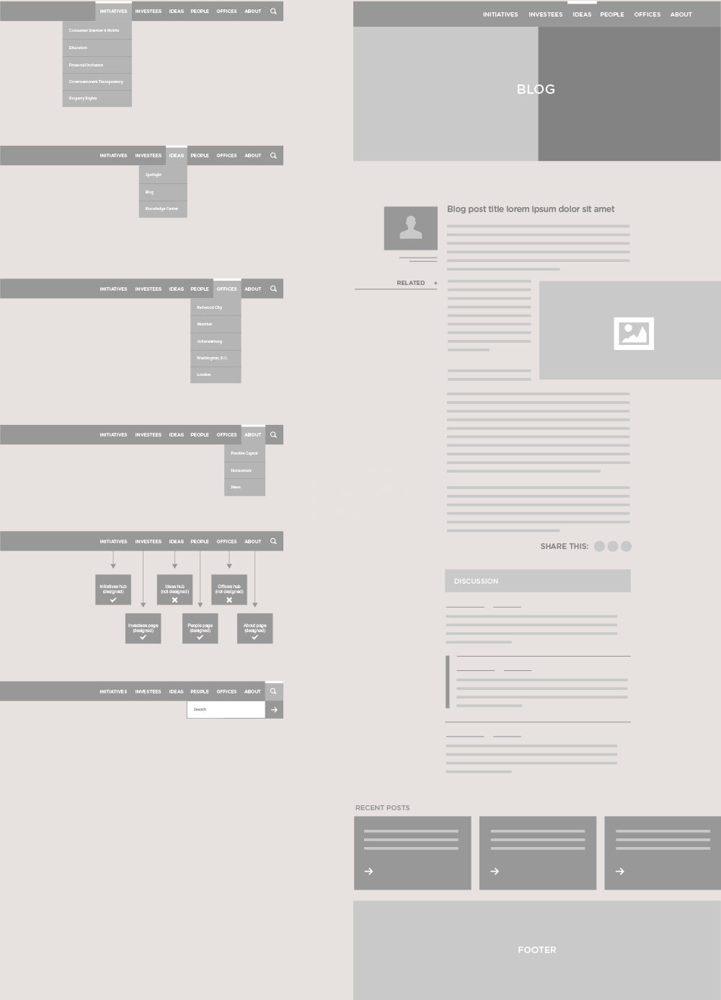
    <figcaption class="case-study-caption">Early wireframes for information architecture and page layout</figcaption>
  </figure>

  

    The Omidyar Network was entering its 10th year of operation, and a refresh to the company identity and web presence as well as a clarification of its mission were a top priority, and one I was tasked with at Enso.
  

  

    To begin, we took what we knew about communication goals and content strategy and loosely storyboarded the navigation and interior pages
  

  

    We knew the Network had several departments that would all need their own pages. Some would be more active than others, but all needed to be fed via the same CMS without breaking the design. Responsive, of course, so it became clear that we'd need a very modular approach.
  

  

    Once we had a basic idea of how things would be connected, we moved into visual design. Omidyar Network wanted a site that demonstrated how it was a large worldwide network, but that they were all still very closely connected. We landed on the idea of aligning the horizons in our photos to show all the various people and places the Network touches.
  

  <figure class="figure-inline">
    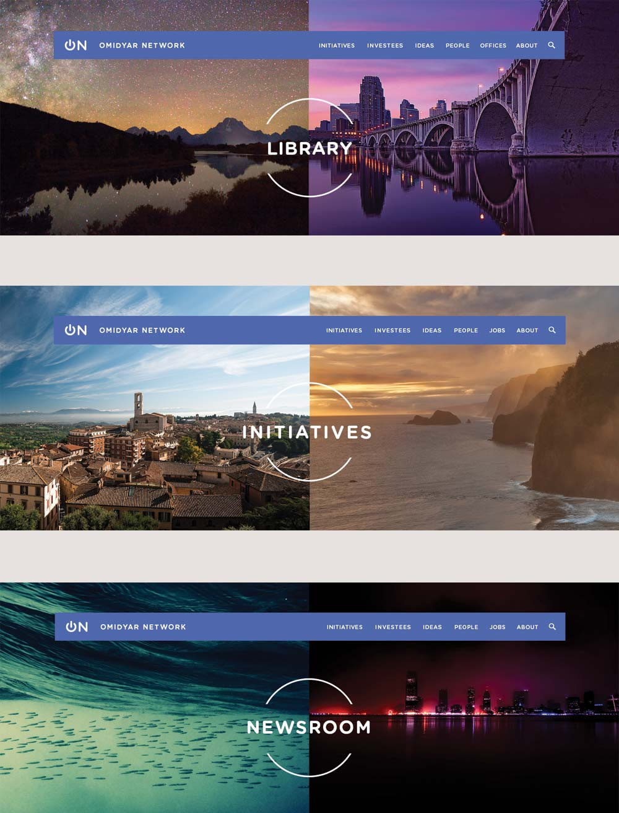
    <figcaption class="case-study-caption"></figcaption>
  </figure>

  

    For the typography I chose H&FJ's Gotham Rounded for it's combination of approachability and strength, and Museo Slab as a sharp, readable serif that juxtaposes nicely against it.
  

  <figure class="figure-inline">
    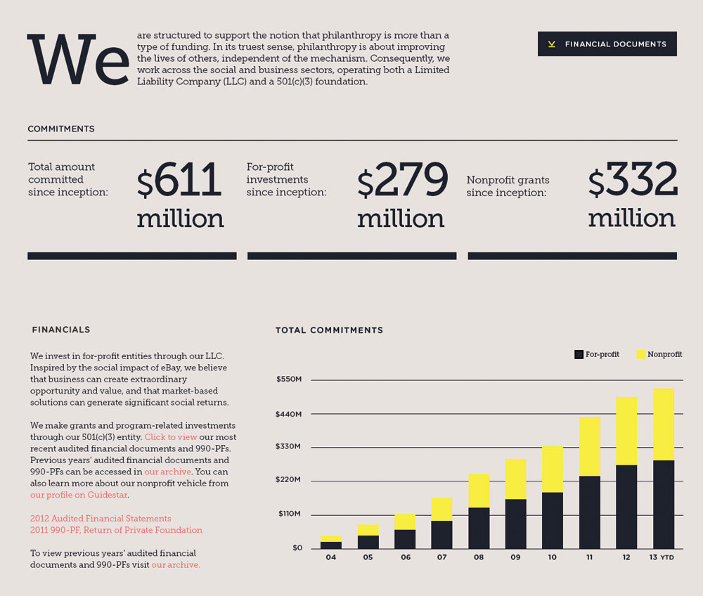
    <figcaption class="case-study-caption"></figcaption>
  </figure>

  <figure class="figure-inline">
    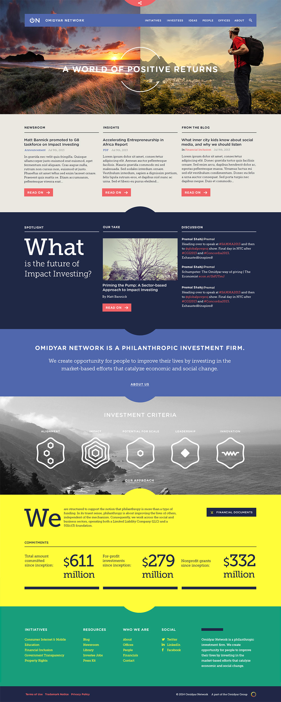
    <figcaption class="case-study-caption">Final homepage mockup</figcaption>
  </figure>

  <figure class="figure-inline">
    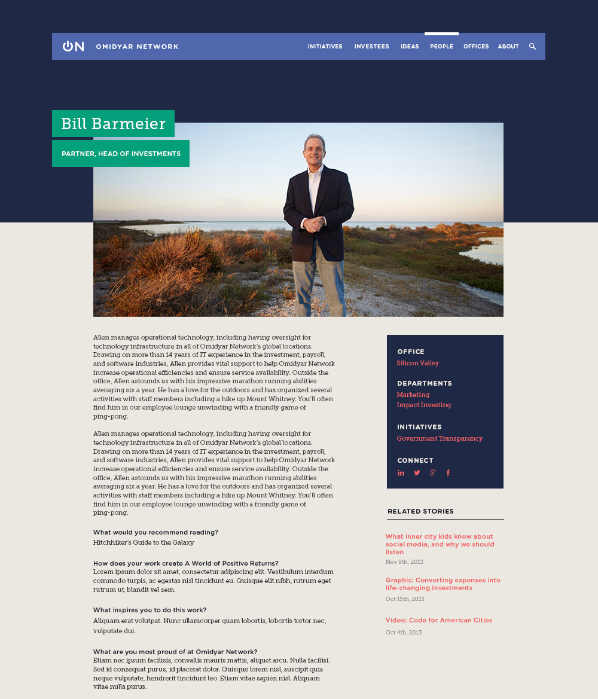
    <figcaption class="case-study-caption">Employee bio page template</figcaption>
  </figure>

  <figure class="figure-inline">
    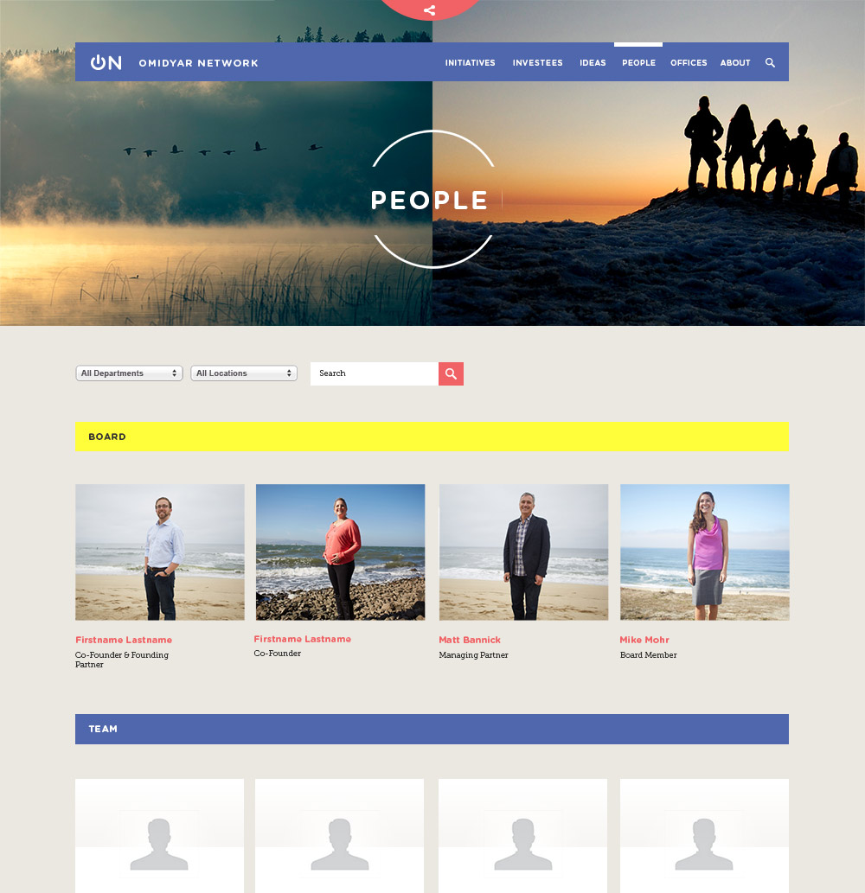
    <figcaption class="case-study-caption"></figcaption>
  </figure>

  <figure class="figure-inline">
    
    <figcaption class="case-study-caption">Employee bio page template</figcaption>
  </figure>

  <h3 class="page-body-subhead">
    Enso
  </h3>
  

    When I joined as Design Lead in 2013, Enso was a small agency with a mission that stood out to me. Their goal was to create positive social impact by partnering with brands who were starting to recognize that creating positive change with their marketing budgets wasn't just an altruistic thing – it was good for business.
  

  

    The first order of business for me was tightening up the branding and translate it into a redesign of the agency website.
  

  <figure class="figure-pullout">
    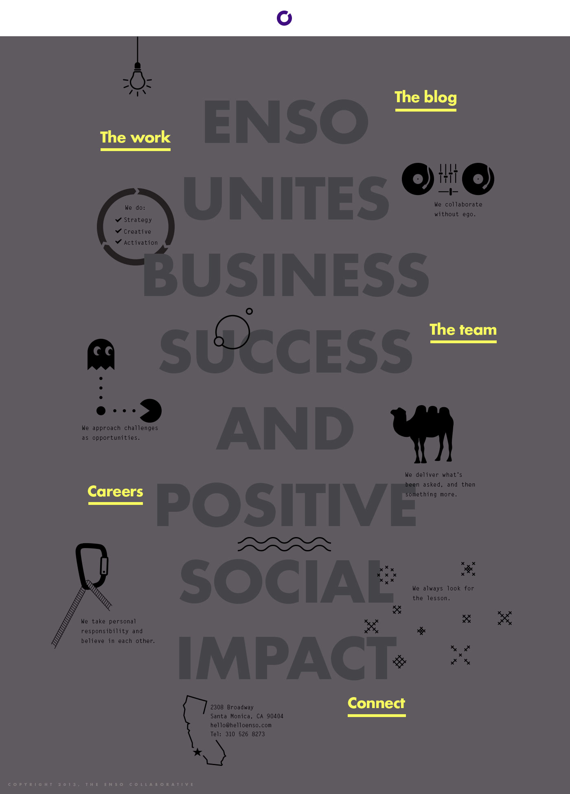
    <figcaption class="case-study-caption">As an easter egg, clicking the lightbulb on the home page toggled to a dark theme.</figcaption>
  </figure>

  <figure class="figure-inline">
    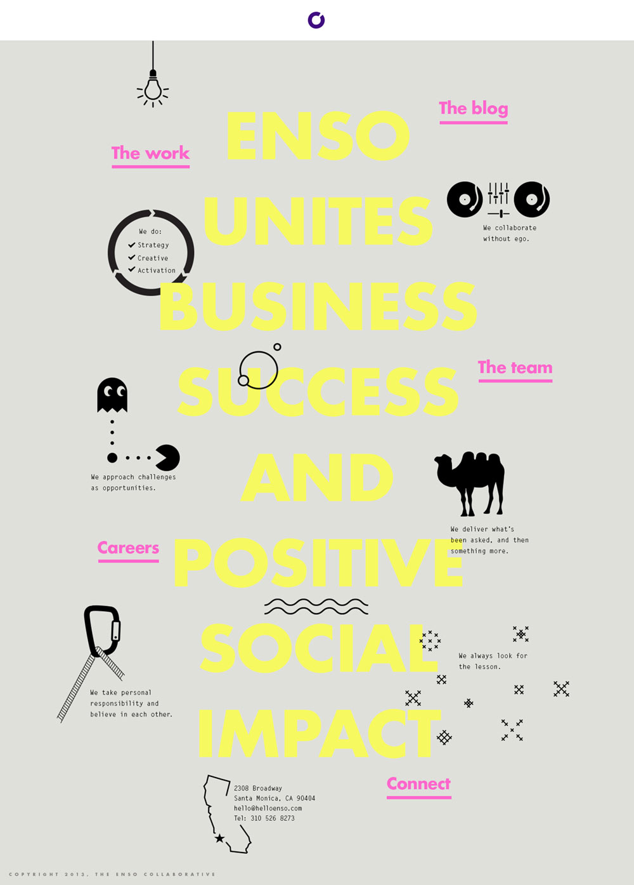
    <figcaption class="case-study-caption">Homepage concept leading with the agency mission and values</figcaption>
  </figure>

  

    Making the Team page was a lot of fun, and a project in itself. Over the course of a week we had each employee wake up early and come out to the beach. Predictably, some of the best facial expressions came when the icy water ran over our feet.
  

  <figure class="figure-inline">
    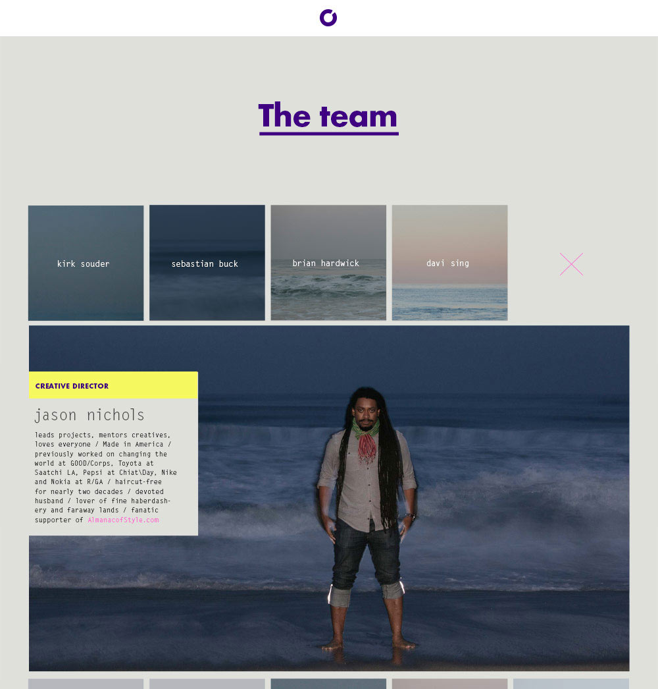
    <figcaption class="case-study-caption"></figcaption>
  </figure>

  

    Case studies were displayed large and clean on a white background. Minimal navigation made it easy to get from one case study to the next, or to simply go back home by clicking the logo.
  

  <figure class="figure-pullout">
    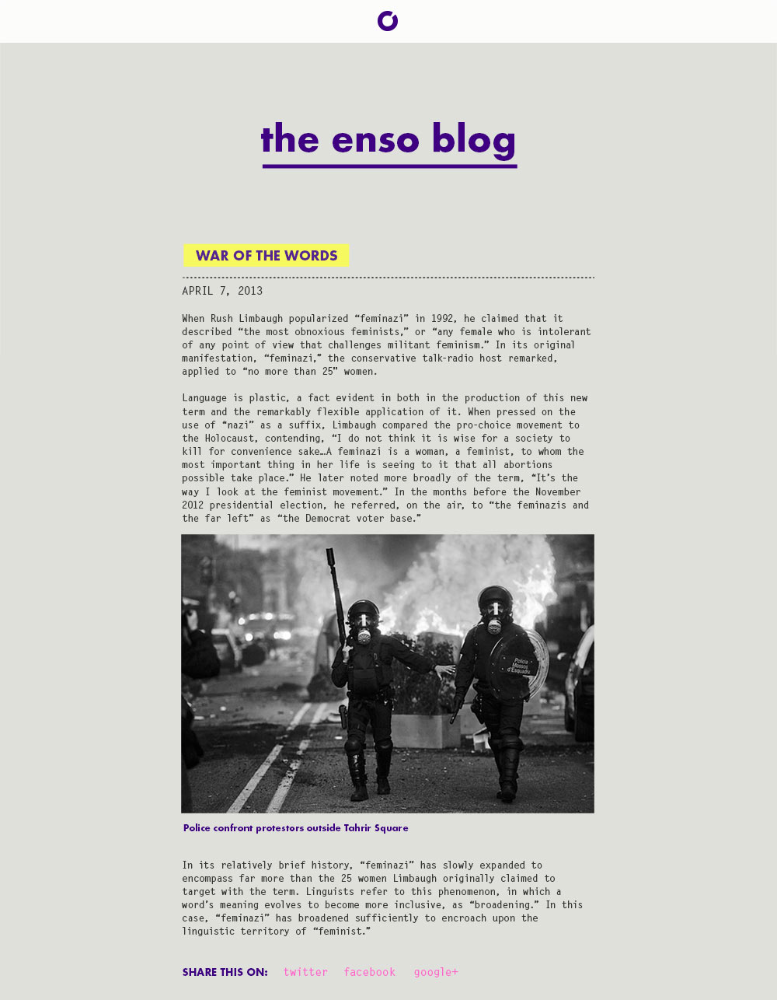
    <figcaption class="case-study-caption">The blog got a very minimal, clean look</figcaption>
  </figure>

  <figure class="figure-inline">
    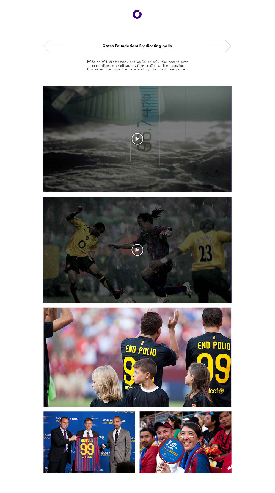
    <figcaption class="case-study-caption"></figcaption>
  </figure>

  

    The launch of helloenso.com was a big success, featured on awwwards, httpster, css awards and other web design curations as well as design blogs like designspiration.net. In sum, the buzz around the site led to a 164% increase in traffic compared to the month previous.
  

  <nav class="case-study-end-nav">
    <a href="/freelance" class="case-study-previous-link freelance-next-link">
      

        2013-2014
      

      Freelance
    </a>
    <a href="/ofa" class="case-study-next-link">
      

        2011-2012
      

      Obama 2012
    </a>
  </nav>

