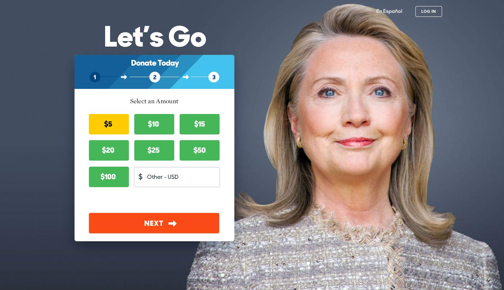
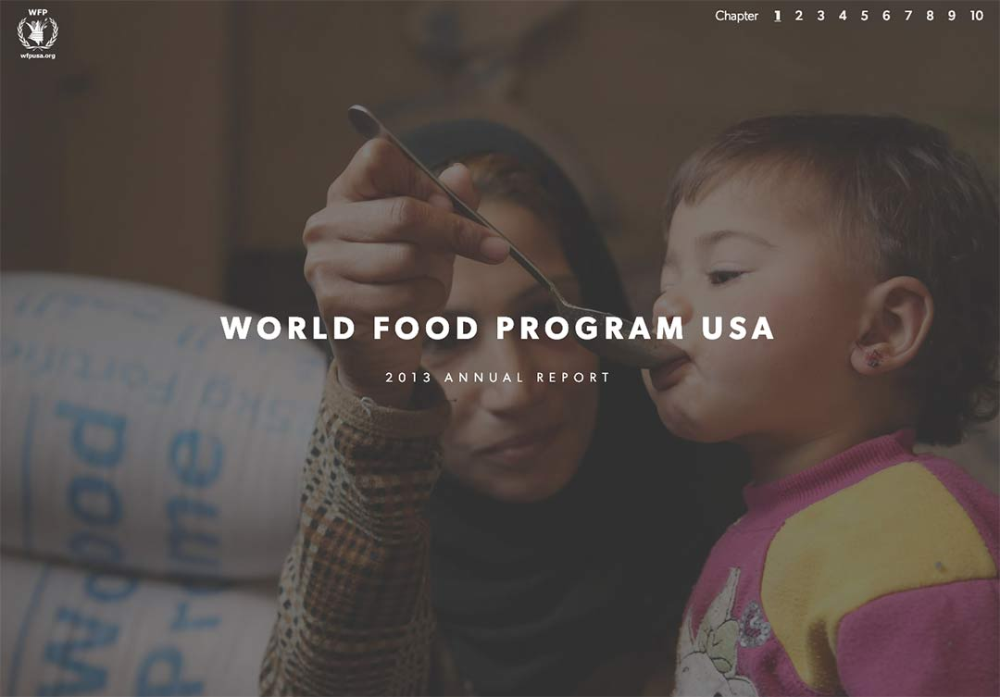
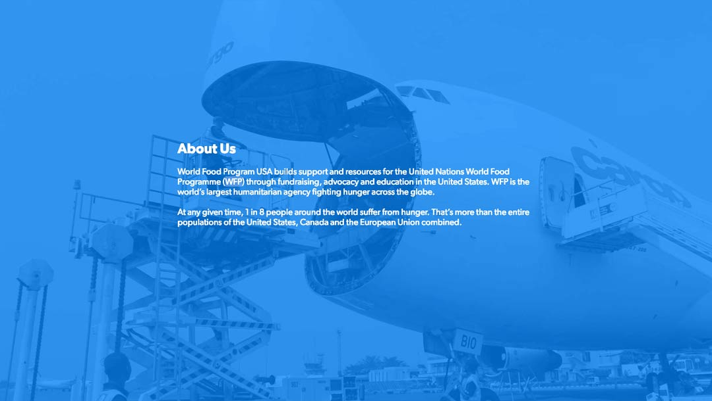
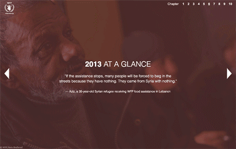
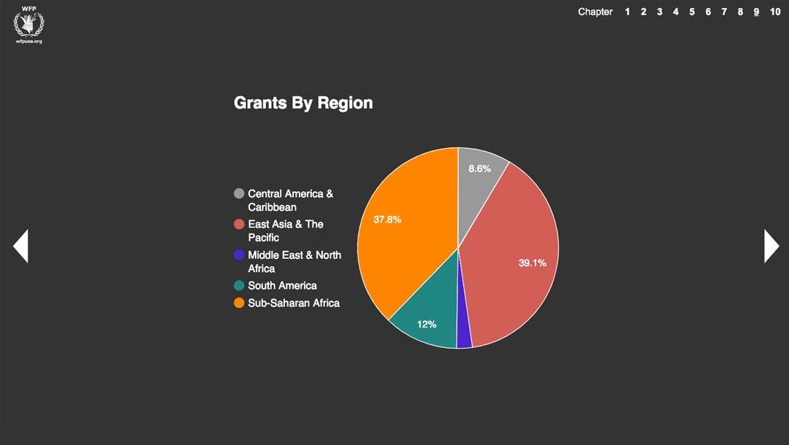
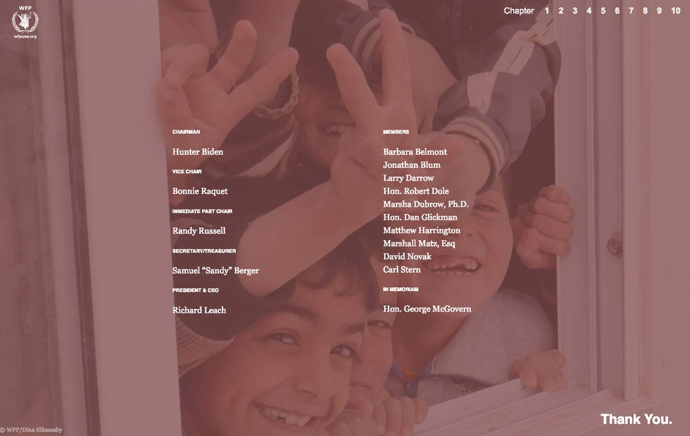

  

    

    <h1 class="word">Freelance</h1>
  

  <h6 class="page-subhead-timespan">
    2013-2014
  </h6>
  <h6 class="page-subhead-responsibilities">
    Visual Design, Frontend Dev
  </h6>

  <h3 class="page-body-subhead">
    Hillary for America
  </h3>
  

    In the run-up to Hillary Clinton's official declaration for candidacy in the upcoming Presidential election, some friends from my time at The Obama campaign reached out looking for some design help to launch her campaign.
  

  

    Working under the project management of Laura Olin at Precision Strategies, I was tasked with delivering some look-and-feel concepts for her official homepage and donation flow. There were loose ideas being floated for content strategy but nothing had been made official yet, so the exploration was fairly blue-sky at that point.
  

  <figure class="figure-inline">
    
    <figcaption class="case-study-caption"></figcaption>
  </figure>

  

    My homepage ideas didn't end up getting used, but the donation flow was built out as the first iteration. Shortly to follow, Hillary for America began onboarding an amazing design team which took over and created a gorgeous visual campaign for candidate Clinton. My work would rightfully fade into history soon thereafter, but I'm proud to have made some small mark on her historic run for President. Here's some of the work I delivered.
  

  <figure class="figure-inline">
    
    <figcaption class="case-study-caption">Concept image for hillaryclinton.com</figcaption>
  </figure>
  <figure class="figure-inline">
    
    <figcaption class="case-study-caption">Concept image for hillaryclinton.com</figcaption>
  </figure>

  <h3 class="page-body-subhead">
    World Food Program
  </h3>

  

    I had a lot of fun designing and building the online annual report for World Food Program. Since the content was divided into chapters, I opted for a scrolling behavior that felt like turning the pages of a large book.
  

  <figure class="figure-inline">
    
    <figcaption class="case-study-caption">Cover of the report with chaptered navigation</figcaption>
  </figure>

  

    WFP had access to a trove of beautiful and heartbreaking photography, showing the need for food around the globe, and the immense scale of their aid and outreach.
  

  <figure class="figure-inline">
    
    <figcaption class="case-study-caption"></figcaption>
  </figure>

  <figure class="figure-pullout">
    
    <figcaption class="case-study-caption">The information architecture allowed for keyboard friendly scrolling in any direction on most views.</figcaption>
  </figure>

  

    Beyond conveying emotion, WFP needed to communicate what it had delivered over the previous year with data. The report would eventually include tables, graphs and an interactive world map showing all the locations visited, and benefitted, by WFP that year.
  

  <figure class="figure-inline">
    
    <figcaption class="case-study-caption">Dynamically generated pie chart showing which regions received the most WFP grants</figcaption>
  </figure>

  <figure class="figure-inline">
    
    <figcaption class="case-study-caption"></figcaption>
  </figure>

  

    I'm proud to have contributed what I could to this wonderful cause. The project was managed by Lauren Parks and Aliya Karim.
  

  <nav class="case-study-end-nav">
    <a href="/olark" class="case-study-previous-link">
      

        2014-2019
      

      Olark
    </a>
    <a href="/enso" class="case-study-next-link enso-next-link">
      
        2013
      
      Enso
    </a>
  </nav>

