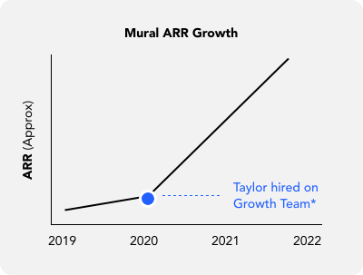
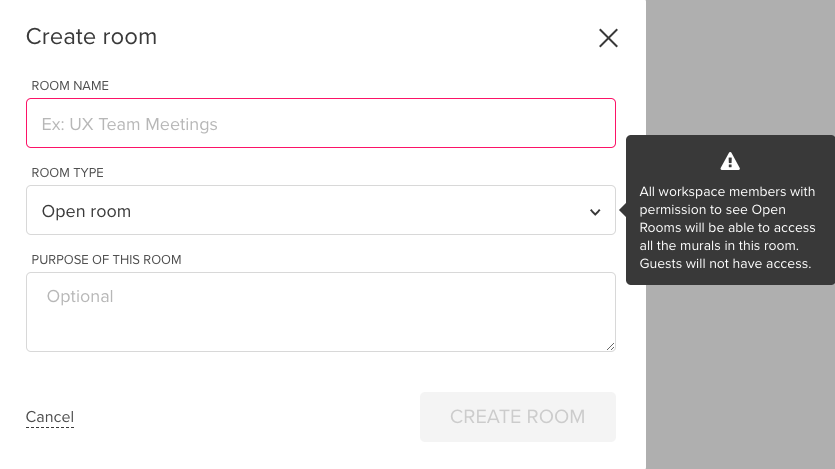
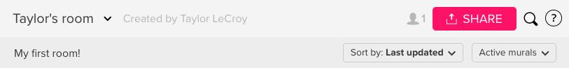
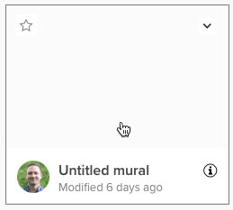
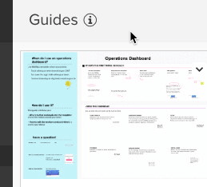
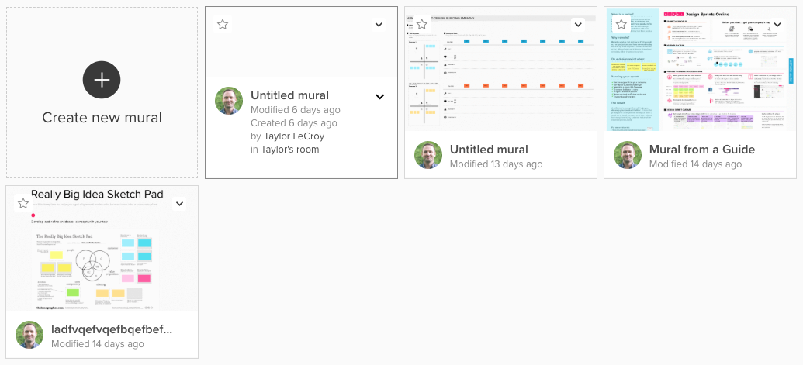
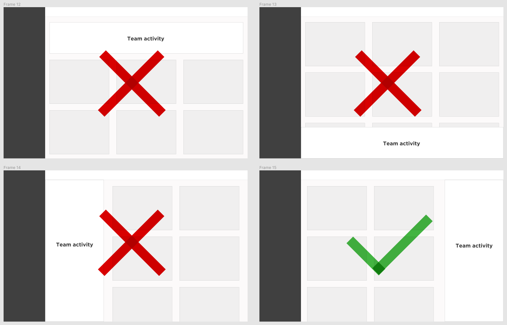
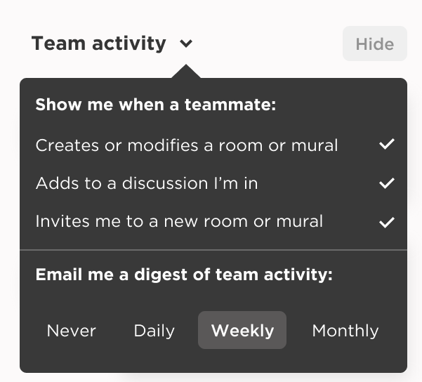
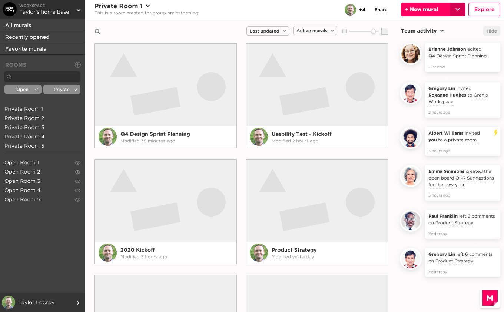

  

    

    <h1 class="word">Mural</h1>
  

  <h6 class="page-subhead-timespan">
    2020-2022
  </h6>
  <h6 class="page-subhead-responsibilities">
    Sr. Product Designer
  </h6>

  <h3 class="page-body-subhead">
    Redesigning signup
  </h3>
  

    In Spring 2021, Mural was growing quickly. The pandemic had accellerated remote work and all of a sudden everyone needed a digital whiteboard to keep collaboration flowing on their newly distributed teams. The moment called for something big. Internally, we began working toward what we called "lightning strike" moments - big upcoming releases to wow our users and announce ourselves as first-class tool in the newly coined category of Collaborative Intelligence. 
    
    In my corner of the product - Growth and Acquisition - this meant managing the bridge between marketing and the users' first product experience. Specifically, we needed to iterate on the existing signup flow to align with a company-wide brand & product refresh, with a focus on delightful moments.
  

  <h4 class="page-body-interior-subhead">
    The problem
  </h4>
  

    Starting in the top left, I saw that my chosen workspace title, though rather short, was truncated after 15 characters. I bet that happens often and wondered if the font size could be smaller while still remaining accessible and readable.
  

  

    Moving down from there, I sought to get my head around the five bolder options presented. Going through the list, it became apparent that the first three were essentially filtered views of the Workspace above. The bottom two items - Templates and Guides were more to browse suggested ways to start new murals. I made a note to explore separating those two concepts in my solution.
  

  <figure class="figure-pullout">
    
    <figcaption class="case-study-caption">*Also the start of the pandemic, but who's to say what had the bigger impact on ARR?</figcaption>
  </figure>
  

    Beneath the top five links, I see rooms divided into two categories: Private and Open. I noticed from the screen shot provided in the brief that Celeste's dashboard view had a lot of overflow in these sections, and that once a certain number of rooms was reached, the list collapsed into an accordion that could be expanded back out with a button. I wondered if somehow the lists could be condensed into one, and the problem of discoverability (finding a buried list) might be mitigated.
  

  

    Creating a new room of each type further gave me hope that the lists could become one, as I noticed the modal shown was identical for public and open, except for defaulting to the privacy type selected.
  

  

    Regarding the modal itself, I saw a potential improvement in that the open room modal has a tooltip that looks alarming and can't be dismissed. It's putpose is to convey what Mural means by an "Open" room type. I also noticed the interaction pattern for selecting a room type is a dropdown with only two options. In most cases I find there is a better option for the interaction and made a note to try it out in my prototype.
  

  <figure class="figure-inline">
    
    <figcaption class="case-study-caption">The tooltip here is just telling me what Open means, but makes me feel like I made a mistake.</figcaption>
  </figure>
  

    Finally at the bottom of the sidebar I have a menu to access my personal information and account-related things. This is a pattern I'm familiar with and don't see any issue here except for the large font size mentioned regarding the Workspace dropdown.
  

  <h4 class="page-body-interior-subhead">
    Component 2: Top bar
  </h4>
  

    My attention shifted next to the top area of the dashboard interface. There's a top stripe with the Title aligned left and an Invite/Share button, search, and question mark icon aligned right. Beneath that, there's a grey bar that houses a room description and filtering options.
  

  

    When in a room, there's a caret to the right of the room name which shows some options that can be taken on the room, and a 'person' icon to the right showing how many people have been invited to the room.
  

  

    My reaction to this was that things might be grouped more contextually. The room description, or "purpose" should be visually paired with the title, and search and filtering functions should live together as well, rather than search by itself up top.
  

  <figure class="figure-inline">
    
    <figcaption class="case-study-caption">The top bar works well enough, but could make better use of space and group elements more contextually.</figcaption>
  </figure>
  

    I also wondered if, rather than writing "Created by John Doe" next to the title, we might be able to represent the room creator visually.
  

  <h4 class="page-body-interior-subhead">
    Component 3: Main canvas
  </h4>
  

    In the main body of the dashboard view we see our murals organized as tiles. On my laptop, the tiles were 4-up, with one fo the four on the top row occupied by the "create a new mural" tile/button.
  

  <figure class="figure-pullout">
    
    <figcaption class="case-study-caption"></figcaption>
  </figure>
  <figure class="figure-pullout">
    
    <figcaption class="case-study-caption">Inconsistent tooltip behavior</figcaption>
  </figure>
  

    My immediate reaction was that it would be interesting to explore the trade-offs of showing the preview tiles larger, at the expense of seeing fewer on screen at one time. As I interacted with the tiles, it made me further wish for more space, not only to show more of a visual preview of the mural board, but to have more room for text and information. The preview function there now feels inconsistent with other info tooltips.
  

  <figure class="figure-inline">
    
    <figcaption class="case-study-caption">The top bar works well enough, but could make better use of space and group elements more contextually.</figcaption>
  </figure>
  

    In addition, while I see the merit in styling the create new mural button like the murals, I feel like it's getting lost somewhat because it blends in so well. I wondered about the tradeoffs of dedicating the entire space to mural tiles.
  

  <h3 class="page-body-subhead">
    Part 2 - Design Proposal
  </h3>
  

    In part 2 of the exercise, we'll design a new version of the dashboard to include some insight into team activity on murals and rooms, with the goal of increasing weekly engagement, and while we're at it, why not try and address some of the potential improvements from part 1.
  

  

    I first needed to work out where in the layout an activity feed would make the most sense. Rather than hide the activity away, to be shown on a click or some other interaction, I decided to display a feed of team activity by default that could be hidden away if users were doing heads-down work or simply didn't want to see it at any time.
  

  

    My sense was that a horizontal layout would make it difficult to read through, so I was down to two vertical layout options for the feed - one on the left side of the murals and the other on the right. I decided to try the feed on the right so that it wouldn't compete with the main navigation sidebar.
  

  <figure class="figure-inline">
    
    <figcaption class="case-study-caption">I decided on a vertical layout for the team activity feed, placed on the opposite side of the main navigation sidebar.</figcaption>
  </figure>
  

    Based on what I know about how teams work together on Mural, I next to document which team activities a user might find value in knowing. To answer the brief, I need to focus on surfacing relevant activity on murals and rooms, and ultimately decided a user should be notified when a teammate:
     
     
    • Creates a new open room
     
    • Creates a new mural in a room you belong to
     
    • Leaves comments on a mural you belong to
     
    • Responds to your comment
     
    • Invites you to a workspace, room or mural
     
    • Invites someone else to a room or mural you belong to
     
    • Archives, moves, renames or deletes a room or mural you belong to
  

  

    It also occurred to me that a feed including all those activity types might become too noisy for some, or might contain a lot of information they may not be interested in. I made a note to try a solution with some abilty to configure the type of news that would appear in the feed.
  

  

    One approach to satisfy the business goal of increased weekly engagement is to send out an emailed digest of activity, perhaps defaulted to once weekly. If users know there are conversations waiting for them or invitations to accept, it would be a strong incentive to open the app and complete those tasks.
  

  <figure class="figure-inline">
    
    <figcaption class="case-study-caption">Users might be able to choose which kinds of activity are most relevant to them.</figcaption>
  </figure>
  

    Here's a final mockup of everything put together, along with a link to the Figma board if you want to look around and click through the prototypes:
  

  <figure class="figure-inline-wider">
    
    <figcaption class="case-study-caption">New dashboard concept for MURAL</figcaption>
  </figure>
  <nav class="case-study-end-nav">
    <a href="/" class="case-study-previous-link">
      Home
    </a>
    <a href="/freelance" class="case-study-next-link freelance-next-link">
      

        2013-2014
      

      Freelance
    </a>
  </nav>

