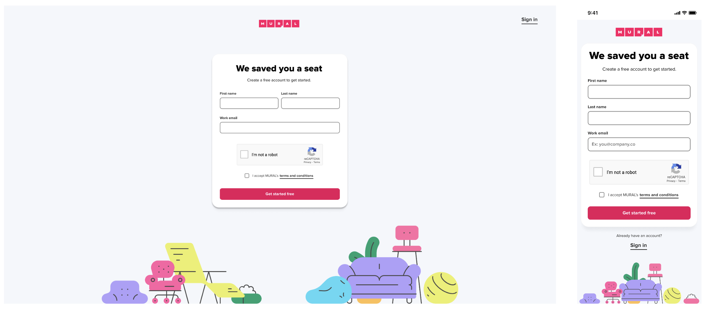
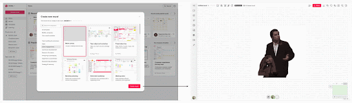

  

    

    <h1 class="word">Mural</h1>
  

  <h6 class="page-subhead-timespan">
    2020-2022
  </h6>
  <h6 class="page-subhead-responsibilities">
    Sr. Product Designer
  </h6>

  <h3 class="page-body-subhead">
    Redesigning signup
  </h3>
  <figure class="figure-pullout">
    
    <figcaption class="case-study-caption">*Also the start of the pandemic, but who's to say what had the bigger impact on ARR?
    </figcaption>
  </figure>
  

    In Spring 2021, Mural was growing quickly. The pandemic had accellerated remote work and all of a sudden everyone needed a digital whiteboard to keep collaboration flowing on their newly distributed teams. The moment called for something big. Internally, we began working toward what we called "lightning strike" moments - big upcoming releases to wow our users and announce ourselves as first-class tool in the newly coined category of Collaborative Intelligence. 
    
    In my corner of the product - Growth and Acquisition - this meant managing the bridge between marketing and the users' first product experience. Specifically, we needed to iterate on the existing signup flow to align with a company-wide brand & product refresh, with a focus on delightful moments.
  

  <h4 class="page-body-interior-subhead">
    The problem
  </h4>
  <figure class="figure-inline">
    
    <figcaption class="case-study-caption">The Mural website is colorful, full of life and movement...</figcaption>
  </figure>
  <figure class="figure-inline">
    
    <figcaption class="case-study-caption">...contrasted with the next step in the flow: a relatively lifeless signup experience</figcaption>
  </figure>
  

    Put bluntly, the signup flow simply didn't live up to the promise of the marketing website. Where was the collaboration, the movement, the color? It almost felt like a different company.

    It wasn't just the first step either. The entire flow followed the same lifeless theme:
  

  <figure class="figure-inline">
    
    <figcaption class="case-study-caption">The greyness will continue until morale improves.</figcaption>
  </figure>
  <h4 class="page-body-interior-subhead">
    The approach
  </h4>
  <figure class="figure-pullout">
    
    <figcaption class="case-study-caption">Composition studies
    </figcaption>
  </figure>
  

    So how to we break this down and begin to move forward? First, we needed to decide what the voice and tone of this flow was going to be. There was some high-level guidance from the brand team, but we needed to decide what aspects of that to dial up for the signup moment specifically. Running some casual brainstorming, we aligned on a tonal direction.

    We also had some previous attempts that hadn't seent he light of day to reference:
  

  <figure class="figure-inline">
    
    <figcaption class="case-study-caption">Working on voice and tone, and learning from previous efforts</figcaption>
  </figure>
  

    From this initial exploration, a visual metaphor started to emerge. Signup should feel like an invitation. Come in. Sit down. Stay awhile.
  

  <figure class="figure-inline">
    
    <figcaption class="case-study-caption">A visual metaphor started to emerge</figcaption>
  </figure>
  

    Next, we needed to finalize the visual hierarchy. In our case, grounding the illustration at the bottom of the viewport made conceptual sense with the chair metaphor, and allowed for easy adaptation to a single-column mobile layout.
  

  <figure class="figure-inline">
    
    <figcaption class="case-study-caption">Grounding the illustration makes conceptual sense, and centers the form as the hero</figcaption>
  </figure>
  

    With the visual design taking shape, it was time to fine-tune the copy with our Content Design team. Copy is as crucial to the success of the final solution as visual design. In fact, probably more so.
  

  <figure class="figure-pullout">
    
    <figcaption class="case-study-caption">Adding final touches with motion design
    </figcaption>
  </figure>
  <figure class="figure-inline">
    
    <figcaption class="case-study-caption">Nailing the copy is as important as nailing the visual design. Probably moreso.</figcaption>
  </figure>
  

    While I ended up leaving Mural before this work shipped as part of the company-wide rebrand, and thus can't speak to it's impact, I'm proud of where we ended up and think the flow looks fantastic in production today. It lives up to the promise of the brand and website and keeps the user engaged and interested as the product makes its ever-important first impression.
  

  <h3 class="page-body-subhead">
    Onboarding refresh
  </h3>
  

    Another project I'm proud of from my Mural years is the work we did to get new workspace creators to the Setup Moment – defined as “Creating a new mural with relevant content” – earlier in their journey.
  

  <h4 class="page-body-interior-subhead">
    The problem
  </h4>
  

    The data told us that 81% of new signups created a mural within their first day, but only 65% added content to the mural. The opportunity here as I saw it was to better enable new creators to put together a mural they were proud to share, faster.

    This needed to be more than just making the share button bigger or adding a standard product tour. It wasn't enough to make sharing easy – creators had to want to share their mural. And in order to achieve that state, they needed to be proud of what they were sharing.
  <figure class="figure-inline">
    
    <figcaption class="case-study-caption">81% of new signups create a mural within 1 day, but only 65% add content to the mural.</figcaption>
  </figure>
  

    I had some quantitative data to go on related to user activities correlated with retention, which would help inform a solution eventually, but a simple heuristic review of the onboarding process revealed a glaring clue: We weren't answering the question "What now?" at the end of our onboarding flow. It was a very sink-or-swim feeling.
  

  <figure class="figure-inline">
    
    <figcaption class="case-study-caption">Sink or swim Mr. Travolta</figcaption>
  </figure>
  

    Based on what I'd discovered, my hypothesis was “We believe if we recommend next steps to new creators entering their first mural, they will create a mural they want to share during onboarding, and therefore reach the Setup Moment on day 1.”

    We'd measure success based on an increase of new creators reaching Setup on day 1 by 10%; with 1-day and 1-week retention serving as secondary success metrics.

    The next step was to identify many different ways to move the needle on those metrics, and weight their trade-offs.
  

  <figure class="figure-pullout">
    
    <figcaption class="case-study-caption">When I set up a brainstorm, I'm looking to tell a story with the pieces of the discovery work I find most insightful.</figcaption>
  </figure>
  

    My immediate reaction was that it would be interesting to explore the trade-offs of showing the preview tiles larger, at the expense of seeing fewer on screen at one time. As I interacted with the tiles, it made me further wish for more space, not only to show more of a visual preview of the mural board, but to have more room for text and information. The preview function there now feels inconsistent with other info tooltips.
  

  <figure class="figure-inline">
    
    <figcaption class="case-study-caption">The top bar works well enough, but could make better use of space and group elements more contextually.</figcaption>
  </figure>
  

    In addition, while I see the merit in styling the create new mural button like the murals, I feel like it's getting lost somewhat because it blends in so well. I wondered about the tradeoffs of dedicating the entire space to mural tiles.
  

  <h3 class="page-body-subhead">
    Part 2 - Design Proposal
  </h3>
  

    In part 2 of the exercise, we'll design a new version of the dashboard to include some insight into team activity on murals and rooms, with the goal of increasing weekly engagement, and while we're at it, why not try and address some of the potential improvements from part 1.
  

  

    I first needed to work out where in the layout an activity feed would make the most sense. Rather than hide the activity away, to be shown on a click or some other interaction, I decided to display a feed of team activity by default that could be hidden away if users were doing heads-down work or simply didn't want to see it at any time.
  

  

    My sense was that a horizontal layout would make it difficult to read through, so I was down to two vertical layout options for the feed - one on the left side of the murals and the other on the right. I decided to try the feed on the right so that it wouldn't compete with the main navigation sidebar.
  

  <figure class="figure-inline">
    
    <figcaption class="case-study-caption">I decided on a vertical layout for the team activity feed, placed on the opposite side of the main navigation sidebar.</figcaption>
  </figure>
  

    Based on what I know about how teams work together on Mural, I next to document which team activities a user might find value in knowing. To answer the brief, I need to focus on surfacing relevant activity on murals and rooms, and ultimately decided a user should be notified when a teammate:
     
     
    • Creates a new open room
     
    • Creates a new mural in a room you belong to
     
    • Leaves comments on a mural you belong to
     
    • Responds to your comment
     
    • Invites you to a workspace, room or mural
     
    • Invites someone else to a room or mural you belong to
     
    • Archives, moves, renames or deletes a room or mural you belong to
  

  

    It also occurred to me that a feed including all those activity types might become too noisy for some, or might contain a lot of information they may not be interested in. I made a note to try a solution with some abilty to configure the type of news that would appear in the feed.
  

  

    One approach to satisfy the business goal of increased weekly engagement is to send out an emailed digest of activity, perhaps defaulted to once weekly. If users know there are conversations waiting for them or invitations to accept, it would be a strong incentive to open the app and complete those tasks.
  

  <figure class="figure-inline">
    
    <figcaption class="case-study-caption">Users might be able to choose which kinds of activity are most relevant to them.</figcaption>
  </figure>
  

    Here's a final mockup of everything put together, along with a link to the Figma board if you want to look around and click through the prototypes:
  

  <figure class="figure-inline-wider">
    
    <figcaption class="case-study-caption">New dashboard concept for MURAL</figcaption>
  </figure>
  <nav class="case-study-end-nav">
    <a href="/" class="case-study-previous-link">
      Home
    </a>
    <a href="/freelance" class="case-study-next-link freelance-next-link">
      

        2013-2014
      

      Freelance
    </a>
  </nav>

