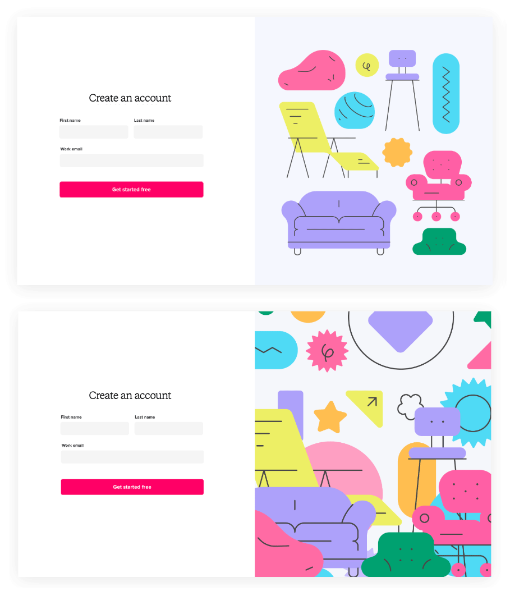
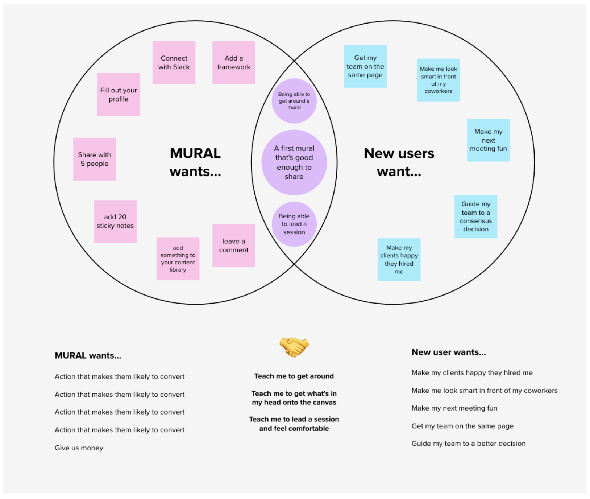
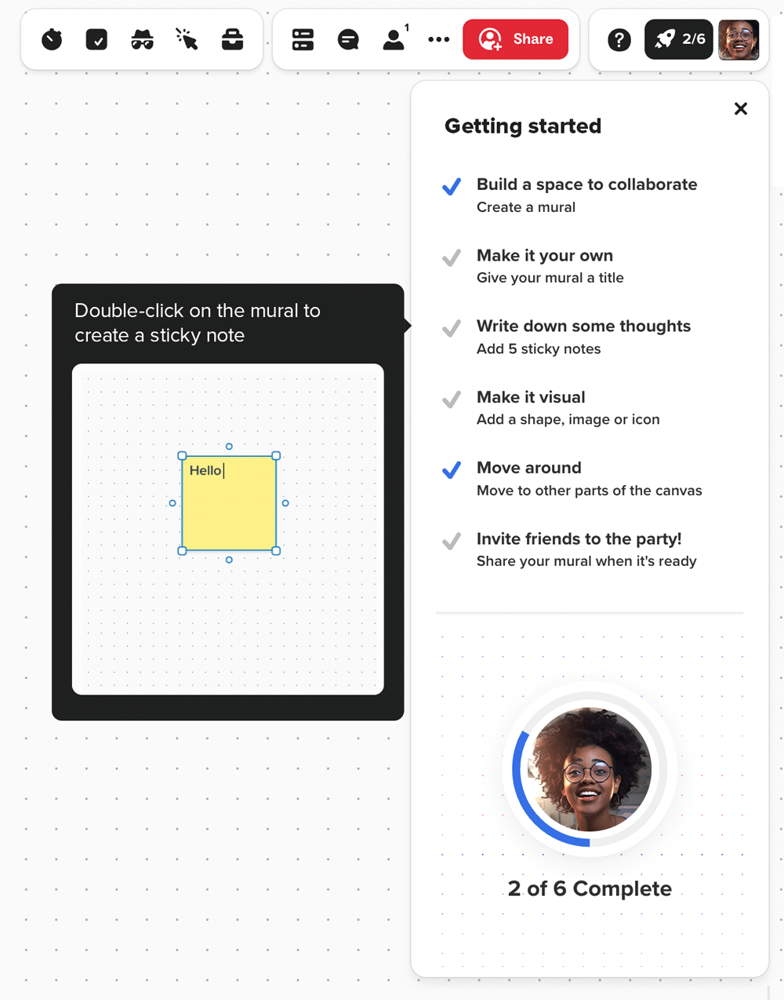

  

    

    <h1 class="word">Mural</h1>
  

  <h6 class="page-subhead-timespan">
    2020-2022
  </h6>
  <h6 class="page-subhead-responsibilities">
    Sr. Product Designer
  </h6>

  <h3 class="page-body-subhead">
    Redesigning signup
  </h3>
  <figure class="figure-pullout">
    <iframe style="border: none" width="400" height="304" src="https://rive.app/s/tutPb4s2uE_qaoTDCc0KsQ/embed" allowfullscreen allow="autoplay"></iframe>
    <figcaption class="case-study-caption">*Also the start of the pandemic, but who's to say what had the bigger impact on ARR 😉
    </figcaption>
  </figure>
  

    It was Spring 2020 and Mural was growing. Quickly. The pandemic had accelerated remote work and, nearly overnight, every company needed a digital whiteboard to keep collaboration flowing on their newly distributed teams. As a product geared toward remote collaboration, we needed to meet the moment.
  

  

    Internally, we began working toward what we called "lightning strike" moments - big, news-worthy releases to wow our users and position ourselves as first-class player in a newly coined category: Collaborative Intelligence. 
  

  

    In my corner of the product - Growth and Acquisition - this meant managing the bridge between marketing and the users' first product experience. Specifically, we needed to iterate on the existing signup flow to align it with a company-wide brand & design system refresh, with a focus on delightful moments.
  

  <h4 class="page-body-interior-subhead">
    The problem
  </h4>
  <figure class="figure-inline">
    
    <figcaption class="case-study-caption">Our new marketing website was colorful, full of life and movement...</figcaption>
  </figure>
  <figure class="figure-inline">
    
    <figcaption class="case-study-caption">...contrasted with the next step in the flow: a flat, lifeless signup experience</figcaption>
  </figure>
  

    Put bluntly, the signup flow simply didn't live up to the promise of the marketing website. Where was the collaboration, the movement, the color? It felt like a different brand and company.
  

  

    It wasn't just the first step either. The entire flow followed the same lifeless theme:
  

  <figure class="figure-inline">
    
    <figcaption class="case-study-caption">The greyness will continue until morale improves.</figcaption>
  </figure>
  <h4 class="page-body-interior-subhead">
    The design approach
  </h4>
  <figure class="figure-pullout">
    
    <figcaption class="case-study-caption">Early composition studies
    </figcaption>
  </figure>
  

    We had to get this right, and the stakeholder map was wide and convoluted. I needed to break this down into manageable steps and begin to move the team forward.
  

  

    First, we needed to align on the voice and tone of this flow. We had the beginnings of a visual style emerging from the brand team, but we needed to decide what aspects to bring into the signup moment specifically. Running some casual brainstorming, we aligned on a tonal direction.
  

  <figure class="figure-inline">
    
    <figcaption class="case-study-caption">Working on voice and tone, and learning from previous efforts</figcaption>
  </figure>
  

    Inviting. Familiar. Warm. These are the feelings a proper signup experience should invoke, within the constraints of a fun and energetic brand.
  

  

    From this initial decision, a visual metaphor then began to emerge. Signup should feel like an invitation. Come in. Sit down. Stay awhile. "Seats" aren't just an integral part of our SaaS pricing and packaging. Taken literally, they're bastions of comfort and safe havens in an increasingly troubling world.
  

  <figure class="figure-inline">
    
    <figcaption class="case-study-caption">A visual metaphor started to emerge</figcaption>
  </figure>
  

    Next, we needed to land on a composition and finalize the visual hierarchy. In our case, grounding the illustration at the bottom of the viewport made conceptual sense with the chair metaphor, and allowed for easy adaptation to a single-column mobile layout.
  

  

    With the visual design taking shape, I then worked on fine-tuning the language with our Content Design team. I've always believed getting the copy right and marrying it to the visual tone is as crucial to the success of the final solution as stunning visual design. In fact, probably more so.
  

  <figure class="figure-pullout">
    
    <figcaption class="case-study-caption">Adding final touches with motion design
    </figcaption>
  </figure>
  <figure class="figure-inline">
    
    <figcaption class="case-study-caption">Nailing the copy is as important as nailing the visual design. Probably moreso.</figcaption>
  </figure>
  

    While I ended up leaving Mural before this work shipped as part of the company-wide rebrand, and thus can't speak to it's impact, I'm proud of where we ended up and think the flow looks fantastic in production today. It lives up to the promise of the brand and website and keeps the user engaged and interested as the product makes its ever-important first impression.
  

  <figure class="figure-inline">
    
    <figcaption class="case-study-caption">The final product - fulfilling the promise of the marketing website and adhering to the in-product design system.</figcaption>
  </figure>
  <h3 class="page-body-subhead">
    Onboarding refresh
  </h3>
  

    Another project I'm proud of from my Mural years is the work we did to get new workspace creators to the Setup Moment – defined as “Creating a new mural with relevant content” – earlier in their journey.
  

  <h4 class="page-body-interior-subhead">
    The problem
  </h4>
  

    The data told us that 81% of new signups created a mural within their first day, but only 65% added content to the mural. The opportunity here as I saw it was to better enable new creators to put together a mural they were proud to share, faster.

    This needed to be more than just making the share button bigger or adding a standard product tour. It wasn't enough to make sharing easy – creators had to want to share their mural. And in order to achieve that state, they needed to be proud of what they were sharing.
  <figure class="figure-inline">
    
    <figcaption class="case-study-caption">81% of new signups create a mural within 1 day, but only 65% add content to the mural.</figcaption>
  </figure>
  

    I had some quantitative data to go on related to user activities correlated with retention, which would help inform a solution eventually, but a simple heuristic review of the onboarding process revealed a glaring clue: We weren't answering the question "What now?" at the end of our onboarding flow. It was a very sink-or-swim feeling.
  

  

    Based on what I'd discovered, my hypothesis was “We believe if we recommend next steps to new creators entering their first mural, they will create a mural they want to share during onboarding, and therefore reach the Setup Moment on day 1.”

    We'd measure success based on an increase of new creators reaching Setup on day 1 by 10%; with 1-day and 1-week retention serving as secondary success metrics.

    The next step was to identify many different ways to move the needle on those metrics and weigh their trade-offs.
  

  <figure class="figure-inline">
    
    <figcaption class="case-study-caption">When I set up a brainstorm, I'm looking to tell a story with the pieces of the discovery work I find most insightful.</figcaption>
  </figure>
  

    A colleague once explained his view of product design process, saying "You're always either making a mess, or cleaning one up." In this case, it was now time to clean up the mess of sticky notes and sketches we had on our brainstorm canvas, and start to synthesize the output. I typically do this by grouping similar ideas and themes and then putting a low fidelity mockup against each. This allows for a followup discussion about what will most likely move the needle with as little cost as possible.
  

  <figure class="figure-inline">
    
    <figcaption class="case-study-caption">Organizing the brainstorm output into themes</figcaption>
  </figure>
  

    After regrouping with a Product Manager and Engineering lead for input on value and cost, respectively, it's time for my favorite part of the process: turning the abstract into something tangible using rapid prototypes. There's no substitute for putting something visual into the team's hands that we can start to mold into the right thing that properly fills the shape of the problem.
  

  <figure class="figure-inline">
    
    <figcaption class="case-study-caption">Prototyping in Figma to find what feels right and what doesn't</figcaption>
  </figure>
  

    With the ability to interact and iterate with prototypes, we zeroed in on an interactive checklist that would live in the canvas when the new user lands for the first time. The items on the list were the ones that helped new users get acquainted and begin building a mural they were proud of, while kicking the tires and exploring at their own pace. They were also actions that correlated strongly with retention.
  

  <figure class="figure-inline">
    
    <figcaption class="case-study-caption">The final product: An answer to "What next?"</figcaption>
  </figure>
  

    The onboarding checklist experiment proved effective, increasing 1-day retention by nearly 29%, and 1-week retention by 11%.
  

  <nav class="case-study-end-nav">
    <a href="/" class="case-study-previous-link">
      Home
    </a>
    <a href="/olark" class="case-study-next-link freelance-next-link">
      
        2014-2019
      
      Olark
    </a>
  </nav>

