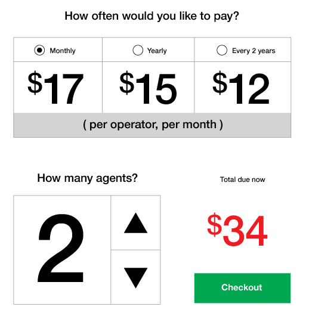
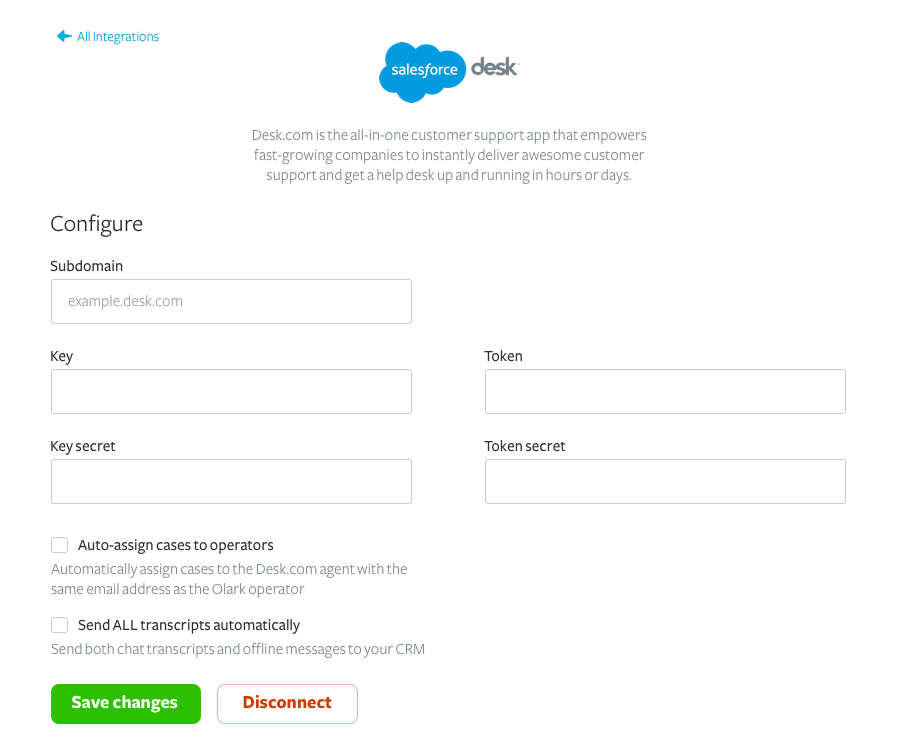

  

    

    <h1 class="word">Olark</h1>
  

  <h6 class="page-subhead-timespan">
    2014 - 2019
  </h6>
  <h6 class="page-subhead-responsibilities">
    Sr. Product Designer
  </h6>

  <h3 class="page-body-subhead">
    Dashboard
  </h3>
  

    The dashboard project was my last one at Olark, launching in April 2019. An ironic end to my time there in some sense, spending my last chapter at the company working on the first thing our customers see after they log in.
  

  

    Our goal for the project was to provide more value earlier in the customer's experience. Chiefly, this meant that the dashboard needed to be a desirable destination whether the person viewing it had any chat data or not.
  

  

    Here's what the existing dashboard looked like. Effectively, it was the navigation all over again, with a little more explanation around the links. Not a lot of value there:
  

  <h4 class="page-body-interior-subhead">
    The old dashboard
  </h4>
  <figure class="figure-inline">
    
    <figcaption class="case-study-caption">The old version of the Olark Dashboard was effectively just another nav.</figcaption>
  </figure>
  

    To begin, I mapped out a user flow that would demonstrate the value of features whose usage we knew correlated strongly with trial conversion. Things like reporting and analytics, and viewing chat transcripts.
  

  <figure class="figure-inline">
    
    <figcaption class="case-study-caption">Early flow diagram for a better dashboard experience</figcaption>
  </figure>
  

    With a path to added value getting clearer, I began prototyping this modular approach that would enable admins to customize their own dashboard, shuffling the components to suit their needs or hiding the ones that weren't as relevant for them.
  

  <figure class="figure-inline">
    
    <figcaption class="case-study-caption">Wireframe showing a modular, customizeable approach to the Dashboard</figcaption>
  </figure>
  

    After working with the project team to scope the work to a specific number of sprints, we were able to make further refinements based on priority. Design specs mapped to user stories (e.g. "As an admin, I can see which agents are logged in now") helped the team build agreement on what things were musts, and which could be deprioritized if time became a factor.
  

  <figure class="figure-pullout">
    
    <figcaption class="case-study-caption">Design specs mapped to user stories help build agreement on priority.</figcaption>
  </figure>
  

    As the engineers turned the user stories into tech specs for the initial build, I refined the prototype and showed it to a handful of current customers with a short list of tasks to catch anything we might be overlooking.
  

  

    One insight I was able to pull out from those sessions was a strong desire to be able to change the date range that the data on the dashboard would be scoped to. We had chosen 2 weeks as a default, but a lot of folks preferred various ranges for various reasons. I was able to present those findings to the team and eventually get a date range picker option shipped with the beta version. Here's how it looked at rollout:
  

  <figure class="figure-inline">
    
    <figcaption class="case-study-caption">The dashboard when it launched in April 2019</figcaption>
  </figure>

  <h3 class="page-body-subhead">
    Brand &amp; UI Design System
  </h3>
  

    By 2017, Olark had been in business 9 years. With a founding team consisting only of engineers, the brand's look and feel hadn't been given as much attention as, well, more engineer-y concerns.
  

  

    To begin we needed a north star to guide our efforts. I put together a short survey and sent it out to a cross section of coworkers to get a feel for how employees generally perceived Olark as a brand, what our voice was, and how we'd like those things to be perceived in the future.
  

  

    From the survey results, I compiled a list of words that people used to describe the kind of company they wanted to work for. When I began tallying words used most often, a theme emerged: Humanity.
  

  <figure class="figure-pullout">
    
    <figcaption class="case-study-caption">Vectorizing the new logo.</figcaption>
  </figure>
  

    When it came to the logo, I wanted to use something hand lettered to capture the human feel. Stakeholders wanted to keep some of the flavor of the original logo, so we stayed with the speech bubble concept and the subtle upward skew.
  

  <figure class="figure-inline">
    
    <figcaption class="case-study-caption">Original logo on left, redesign on right.</figcaption>
  </figure>
  

    Another decision I made early on was that I wanted to use real photography rather then illustration. Besides being the more Human thing to do, real faces cause visceral reactions in audiences. There was also a sea of sameness emerging around that time with tech companies and startups all using illustration on their branding and marketing sites.
  

  

    The tradeoff I faced with using real photography was that I was going to have to use stock photography. We didn't have the time or resources to do our own shoot. Fortunately, I was able to find a nice set of portraits with a background I could recreate for future use.
  

  <figure class="figure-inline">
    
    <figcaption class="case-study-caption">Well-lit portraits would be used to represent chat agents and customers. It was important to include a diversity of racial backgrounds and ages.</figcaption>
  </figure>
  

    To round out the photography specs in the styleguide, I wanted to create a photo treatment that any designer could use, that would make our lifestyle imagery feel less stock-y and give it all a consistent feel. I settled on a dreamy, almost light-leaky treatment that felt human and warm. I then recorded a <a href="https://www.youtube.com/watch?v=ow-m6EErJuk" class="paragraph-link">screencast tutorial</a> so that other designers would be able to easily apply the treatment.
  

  <figure class="figure-inline">
    
    <figcaption class="case-study-caption">I chose a warm, dreamy treatment for lifestyle photography.</figcaption>
  </figure>
  

    Next up, we needed a color palette. I'd learned from trying to work within previous styleguides that having too limited a palette led to frustration and an overwhelming desire to use "in-between" colors in certain sitations where the guide didn't spec out something light or dark enough. This was often the case with section backgrounds. To keep it feeling human and diverse, I decided on a full-spectrum palette that would include all colors of the spectrum, rather than honing in on one color that the brand would try to own.
  

  <figure class="figure-pullout">
    
    <figcaption class="case-study-caption">Olark's color palette</figcaption>
  </figure>
  

    After selecting a sample of colors to be used as "primaries", I used lightness and saturation to create levels within each color, which were used as CSS variables. The lightest shade, <code>{color}50</code>, was typically used as a background color for a section or component.
  

  

    Another important aspect of the redesigned branding would be vector elements. "Make Business Human" was our new tagline, so it was important to have some consistent pieces that designers could use to convey humanity and business graphically.
  

  <figure class="figure-inline">
    
    <figcaption class="case-study-caption">Vector elements to marry the concepts of business and humanity.</figcaption>
  </figure>
  

    With the main pieces in place, I went on to define styling for typography, buttons, forms, lists, cards, spacing and other aspects.
  

  <h4 class="page-body-interior-subhead">
    Extensible CSS
  </h4>
  

    Our current way of styling things showed the classic signs of different contributors doing things their own ways over the years. As is often the case when many hands are involved, from one repo to the next you might see Sass, Stylus or vanilla CSS.
  

  

    We decided to consolidate everything to Stylus and codify the presentational aspects of the styleguide components – colors, shadows, everything except where it goes on the page and the space around it – into base classes.
  

  <code class="element-descriptor-code">
$card

  </code>
   
  <code class="element-descriptor-code code-indented">
background-color: white;

    
border-radius: 22px;

    
box-shadow: $card-shadow;

  </code>
  

    

      This is the card title
    

    This is the body of the card
  

  <code class="element-descriptor-code">@extends $card
  </code>
   
  <code class="element-descriptor-code bottom-pad">text-align: center;
  </code>
  

    To give designers flexibility within the system, I only included the styles in the base classes that I felt strongly would apply in nearly any layout situation, allowing room for overrides in more specific classes.
  

  

    Check out our <a href="https://www.olark.com/styleguide" class="paragraph-link">public style guide</a>
  

  <h3 class="page-body-subhead">
    Simplifying Billing
  </h3>
  

    There's no more sensitive part of an app you can touch than the system that charges your customers money. You can play fast and loose with just about anything else and only receive mild frustration if something goes unaccounted for. Overcharge a customer by accident, however, and you risk being perceived as a dishonest swindler - and word travels fast.
  

  

    When I arrived at Olark in 2014, Olark was using a simple rails app to handle billing. There soon came a desire to allow customers more options and flexibility over their live chat team and plan, while keeping the cognitive overhead low. This is a screen grab I took of the billing app circa that time:
  

  <h4 class="page-body-interior-subhead">
    The old billing UI
  </h4>
  <figure class="figure-inline">
    
    <figcaption class="case-study-caption">The Olark billing app circa 2014 was just three large buttons.</figcaption>
  </figure>
  

    Customers had little control over what they were paying us each month. They could pick from four different tiers of pricing, each allowing a fixed number of agents on the chat team, and some elevated features for the more premium tiers.
  

  

    What we found our customers wanted was to pay for only what they were using, rather than prearranged batches of features and agent seats they weren't using. We decided to move to a per-agent billing system, where a customer would needed only make two decisions: how many agents they wanted and how often they wanted to be billed. Everything else would just work.
  

  <figure class="figure-inline">
    
    <figcaption class="case-study-caption">Wireframe showing an early look at proposed functionality.</figcaption>
  </figure>
  

    We also decided to offer a discount for a longer commitment. Paying monthly would cost a little more than paying for a year or two years at a time. In addition, we wanted to surface valuable information that our CS team was getting bogged down with: How many seats weren't being used, when the next billing cycle began, and the amount that would be charged at that time.
  

  <figure class="figure-inline">
    
    <figcaption class="case-study-caption">The billing app after redesign.</figcaption>
  </figure>

  <h3 class="page-body-subhead">
    Integrations
  </h3>
  

    Olark is a simple yet powerful tool for chatting with visitors on your website, but in order to me more useful to people, it needed to fit into existing workflows. Many of our customers use CRM tools like Salesforce and Zendesk to manage customer relationships over time, and a chat transcript with a customer helps add valuable context to those cases and leads.
  

  

    For most of 2016, I worked on Olark's Integrations Team to build out the number and quality of our connections to third party apps, and was tasked with creating an interface for the full catalog of connections and how our customers would configure them, manage them and better understand their value.
  

  <figure class="figure-pullout">
    
    <figcaption class="case-study-caption">An early user flow diagram showing integrations with user stories.</figcaption>
  </figure>
  

    After wireframing the flow to better understand how user needs would map to page states, I began exploring layout options that would give a summary of the benefits of each integration option in an easily scannable menu.
  

  <figure class="figure-inline">
    
    <figcaption class="case-study-caption">One early iteration of the integrations portal.</figcaption>
  </figure>
  

    An early layout option, shown above, made it easy to understand which integrations were connected and how to configure them, but in the context of an ever-growing list we weren't satisfied that it would be easy to scan the list and find the integration one was looking for.
  

  

    In parallel, I also began defining the experience of configuring each individual integration. An early idea looked clean and simple, but I wasn't satisfied with the side-by-side layout of the form fields. It looked like too much work compared to a single-column fieldset:
  

  <figure class="figure-inline">
    
    <figcaption class="case-study-caption">An early idea for the configuration page that didn't make the cut.</figcaption>
  </figure>
  

    Wanting to make the portal page easier to scan, I tried a list layout instead of a grid and found it made a world of difference. We then added search and filtering by integration type to make it a snap to find the app a visitor was looking for.
  

  <figure class="figure-inline">
    
    <figcaption class="case-study-caption">We finally settled on a list-based layout for easy scanning.</figcaption>
  </figure>
  

    For the configuration pages, we moved toward a side-by-side layout that would allow a single column fieldset to sit alongside a step-by-step visual demonstration of the benefits of the integration, in order to both sell the merits of connecting Olark to the app and make it easy to set things up to certain specifications.
  

  <figure class="figure-inline">
    
    <figcaption class="case-study-caption">A side-by-side layout for the config pages allowed for a single column fieldset and a ste-by-step demo of the integration.</figcaption>
  </figure>
  <nav class="case-study-end-nav">
    <a href="/enso" class="case-study-previous-link freelance-next-link">
      
        2019-2022
      
      Mural
    </a>
    <a href="/freelance" class="case-study-next-link freelance-next-link">
      
        2013-2014
      
      Freelance
    </a>
  </nav>

